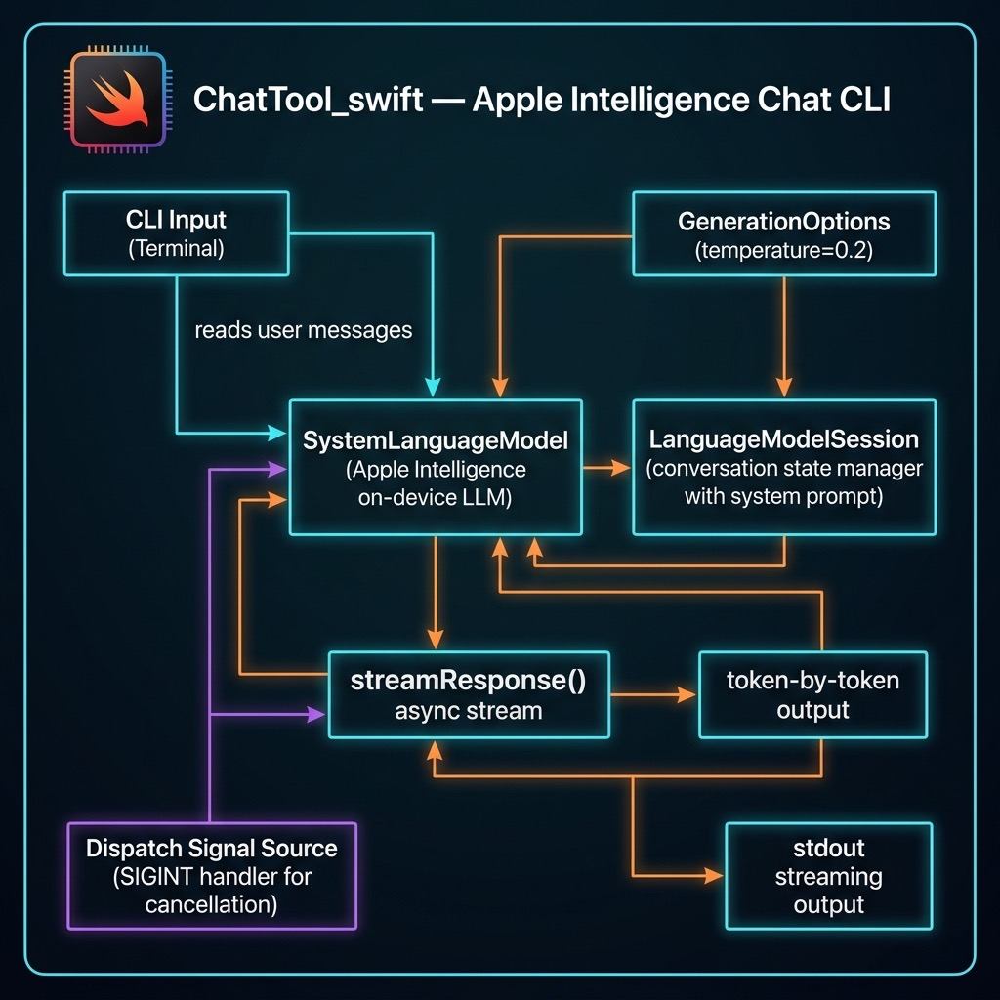

# Using Apple Intelligence's Default System Model To Build a Chat Command Line Tool

Here we create a simple command line chat tool. The LLM specific code can also be used in iOS, iPadOS, and macOS applications. This chat tool will use the local system LLM for simple queries and will transparently call a more capable model on Apple's servers in a secure and privacy preserving sandbox.  

The following Swift package manifest defines an executable command-line program named **chattool** designed to run on macOS. The tool relies on Apple's swift-argument-parser package to process command-line arguments.

**Package.swift:**

```swift
// swift-tools-version: 6.2
import PackageDescription

let package = Package(
    name: "ChatTool",
    platforms: [.macOS(.v26)],   // macOS 15/16 is fine too
    products: [
        .executable(name: "chattool", targets: ["ChatTool"])
    ],
    dependencies: [
        // ⬇︎ Apple’s official argument-parsing package
        .package(url: "https://github.com/apple/swift-argument-parser.git",
                 from: "1.3.0")
    ],
    targets: [
        .executableTarget(
            name: "ChatTool",
            // expose the ArgumentParser product to the target
            dependencies: [
                .product(name: "ArgumentParser", package: "swift-argument-parser")
                // FoundationModels is an Apple framework, no SPM entry needed
            ],
            path: "Sources/ChatTool"          // adjust if your path differs
        )
    ]
)
```

**ChatTool.swift:**

This Swift code implements a command-line chat interface that interacts directly with Apple's native FoundationModels framework. Upon launch, it verifies the system's default language model is available, initializes a LanguageModelSession with a hard-coded system prompt and temperature, and then enters a read-evaluate-print loop. The program continuously accepts user input from the console and sends it to the language model for processing until the user quits.

The core of the implementation leverages modern Swift concurrency (async/await) to handle the model's output as an asynchronous stream. For each user prompt, it iterates through the text fragments as they are generated by session.streamResponse, writing only the new characters to standard output to create a real-time, typewriter-like effect. To enhance usability, it uses a DispatchSource to set up a signal handler for SIGINT (Ctrl+C), allowing a user to cancel the current in-progress stream from the model without terminating the entire chat application.



```swift
import Foundation
import FoundationModels
import Dispatch

@main
struct ChatCLI {
    static func main() async throws {
        // Hard-coded defaults
        let temperature  = 0.2
        let sysPrompt    = "You are a helpful assistant."

        // Verify model
        let model = SystemLanguageModel.default
        guard model.isAvailable else {
            throw RuntimeError(
                "Model unavailable: \(model.availability)")
        }

        let session = LanguageModelSession(
            instructions: sysPrompt)
        print("Temperature: \(temperature)")
        print("System Prompt: \(sysPrompt)")
        let options = GenerationOptions(temperature: temperature)

        print("Apple-Intelligence chat (T=0.2). /quit to exit.\n")

        while true {
            print("Enter your message: ", terminator: "")
            guard let prompt =
                readLine(strippingNewline: true) else { break }
            if prompt.isEmpty || prompt == "/quit" { break }

            var previous = ""   // text already printed

            let task = Task {
                for try await part in session.streamResponse(
                    to: prompt, options: options) {
                    let current: String = String(describing: part)
                    // emit only new characters
                    let delta = current.dropFirst(previous.count)
                    if !delta.isEmpty {
                        FileHandle.standardOutput.write(
                            Data(delta.utf8))
                        fflush(stdout)
                        previous = current
                    }
                }
                print() // newline when complete
            }

            // ^C cancels the streaming task
            signal(SIGINT, SIG_IGN)
            let sigSrc = DispatchSource.makeSignalSource(
                signal: SIGINT, queue: .main)
            sigSrc.setEventHandler { task.cancel() }
            sigSrc.resume()
            defer { sigSrc.cancel() }

            _ = try await task.value
        }
    }
}

/// Simple error wrapper
struct RuntimeError: Error, CustomStringConvertible {
    let description: String
    init(_ msg: String) { description = msg }
}
```

Here is sample output from two prompts:

```text
$ swift run
[1/1] Planning build
Building for debugging...
[1/1] Write swift-version--58304C5D6DBC2206.txt
Build of product 'chattool' complete! (0.12s)
Temperature: 0.2
System Prompt: You are a helpful assistant.
Apple-Intelligence chat (T=0.2). /quit to exit.

Enter your message: why is the sky blue?
The sky appears blue due to a phenomenon called Rayleigh scattering.
This occurs because the Earth's atmosphere is composed of gases and
small particles, such as nitrogen and oxygen. When sunlight enters
the atmosphere, it collides with these particles.

Sunlight is made up of different colors, each with a different
wavelength. Blue light has a shorter wavelength than other colors,
such as red or yellow. Because of this shorter wavelength, blue light
is scattered in all directions by the gases and particles in the
atmosphere.

As a result, when we look up at the sky, we see the scattered blue
light more prominently than the other colors. This is why the sky
appears blue during the day.

Enter your message: write a Swift function to print the first 11 prime numbers
Here is a Swift function that prints the first 11 prime numbers:

```swift
func printFirst11PrimeNumbers() {
    var primes: [Int] = []
    var num = 2

    while primes.count < 11 {
        var isPrime = true

        for prime in primes {
            if prime * prime > num { break }
            if num % prime == 0 {
                isPrime = false
                break
            }
        }

        if isPrime { primes.append(num) }
        num += 1
    }

    print("The first 11 prime numbers are: \(primes)")
}

printFirst11PrimeNumbers()
```

This function starts with the smallest prime number, 2, and checks
each subsequent number to see if it is prime. If it is, it adds it
to the `primes` array. The loop continues until there are 11 prime
numbers in the array, at which point it prints them.

Enter your message: /quit
```
