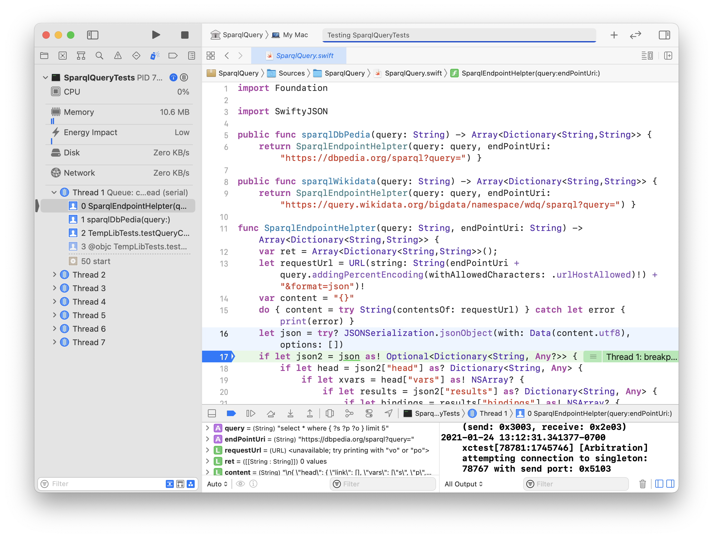

# Repl Based Development and Writing Command Line Utilities in Swift

As an AI practitioner, I have several modes of exploring ideas by writing code: interactive in a REPL (for Swift we will use Playgrounds), command line utilities to package useful code for use in production and as general utilities, end user GUI applications, and part of back-end code in web apps. Here we will cover strategies for writing useful command line utilities, some specific to macOS and others general purpose that are also useful in Linux and Windows.

We saw how to use the Swift Package Manager to create two types of command line applications:

- Executable, for example: **swift package init --type executable**
- Library with optional main test function, for example: **swift package init --type library**

Before I first started doing REPL based Swift development, I Swift to create small command line executable applications. My habbits changed when I realized that only library projects lended themselves to the style of REPL development that I have enjoyed for many decades using languages such as Common lisp.

## SparqlQuery Library

TBD

I placed this library in its own github repository [https://github.com/mark-watson/SparqlQuery](https://github.com/mark-watson/SparqlQuery) because it is convenient to add Swift libraries to projects by refering to their github URI, possibly adding a version number.

The Swift Package Manager creates a template project. The following listing shows the directory structure after I implemented the library:

```
$ tree
├── Package.swift
├── README.md
├── Sources
│   └── SparqlQuery
│       └── SparqlQuery.swift
└── Tests
    └── SparqlQueryTests
        └── main.swift
```

A file Package.swift was also generated. Here is the package after editing:

```swift
$ cat Package.swift 
// swift-tools-version:5.3
// The swift-tools-version declares the minimum version of Swift required to build this package.

import PackageDescription

let package = Package(
    name: "SparqlQuery",
    products: [
        // Products define the executables and libraries a package produces, and make them visible to other packages.
        .library(
            name: "SparqlQuery",
            targets: ["SparqlQuery"]),
    ],
    dependencies: [
        // Dependencies declare other packages that this package depends on.
        // .package(url: /* package url */, from: "1.0.0"),
      .package(url: "https://github.com/SwiftyJSON/SwiftyJSON.git", .branch("main")),
   ],
    targets: [
        // Targets are the basic building blocks of a package. A target can define a module or a test suite.
        // Targets can depend on other targets in this package, and on products in packages this package depends on.
        .target(
            name: "SparqlQuery",
            dependencies: ["SwiftyJSON"]),
        .testTarget(
            name: "SparqlQueryTests",
            dependencies: ["SparqlQuery", "SwiftyJSON"]),
    ]
)
```

## REPL Adventures with the SparqlQuery Library

Working in the directoy for the SparqlQuery library, it is simple to open a REPL session with the library loaded and available.

Notice on line 8 that I do need to import the library:

```swift
$ swift run --repl 
[1/1] Linking libSparqlQuery__REPL.dylib
Launching Swift REPL with arguments: -I/Users/markw_1/GITHUB/SwiftAI-book-code/SparqlQuery/.build/arm64-apple-macosx/debug -L/Users/markw_1/GITHUB/SwiftAI-book-code/SparqlQuery/.build/arm64-apple-macosx/debug -lSparqlQuery__REPL
Welcome to Apple Swift version 5.3.2 (swiftlang-1200.0.45 clang-1200.0.32.28).
Type :help for assistance.
  1> import SparqlQuery
  2> let results = sparqlDbPedia(query: "select * where { ?s ?p 'Bill Gates'@en } limit 3") 
results: [[String : String]] = 3 values {
  [0] = 2 key/value pairs {
    [0] = {
      key = "s"
      value = "http://dbpedia.org/resource/Bill_Gates"
    }
    [1] = {
      key = "p"
      value = "http://www.w3.org/2000/01/rdf-schema#label"
    }
  }
  [1] = 2 key/value pairs {
    [0] = {
      key = "s"
      value = "http://dbpedia.org/resource/Category:Bill_Gates"
    }
    [1] = {
      key = "p"
      value = "http://www.w3.org/2000/01/rdf-schema#label"
    }
  }
  [2] = 2 key/value pairs {
    [0] = {
      key = "p"
      value = "http://xmlns.com/foaf/0.1/name"
    }
    [1] = {
      key = "s"
      value = "http://dbpedia.org/resource/Bill_Gates"
    }
  }
}
  3> let first_result = results[0]
first_result: [String : String] = 2 key/value pairs {
  [0] = {
    key = "s"
    value = "http://dbpedia.org/resource/Bill_Gates"
  }
  [1] = {
    key = "p"
    value = "http://www.w3.org/2000/01/rdf-schema#label"
  }
}
  4> first_result["s"]
$R0: String? = "http://dbpedia.org/resource/Bill_Gates"
  5> results[1]["p"]
$R1: String? = "http://www.w3.org/2000/01/rdf-schema#label"
  6> $R0
$R2: String? = "http://dbpedia.org/resource/Bill_Gates"
 ```

On line 43 I created a new local valiable **first_result** whose type is a hashtable with string keys and string values.

There are two documentation web pages that you can use as references:
[Apple's Swift Developer Blog of REPL](https://developer.apple.com/swift/blog/?id=18)
and
[REPL Support for Swift Packages on Swift.org](https://swift.org/blog/swiftpm-repl-support/).

## Using Apple's XCode IDE

If you are not familiar with XCode then please refer to [Apple's XCode documentation](https://developer.apple.com/xcode/) as-needed.

As an example let's look at this same library project SparqlQuery open in XCode. On my system, this libary is located at **GITHUB/SwiftAI-book-code/SparqlQuery** and using XCode is as simple as using the **File / Open** menu to open this directory.


We can run the test using the menu **Product / Test**. In the following screen shot I set a breakpoint on line 17 of the file SparqlQuery.swift file:




## Using SqLite Embedded Database

TBD

## Implementing a Caching SparqlQuery Library

TBD


