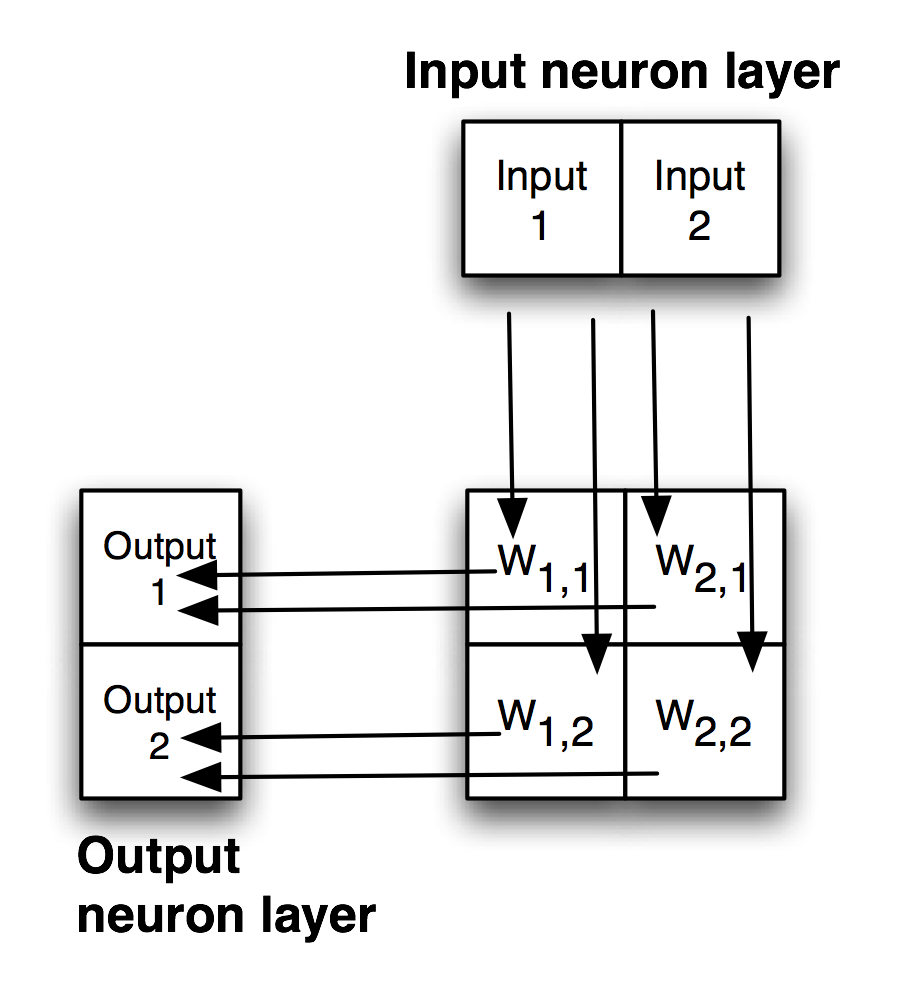
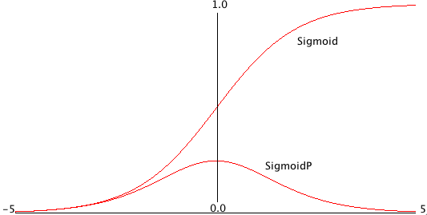
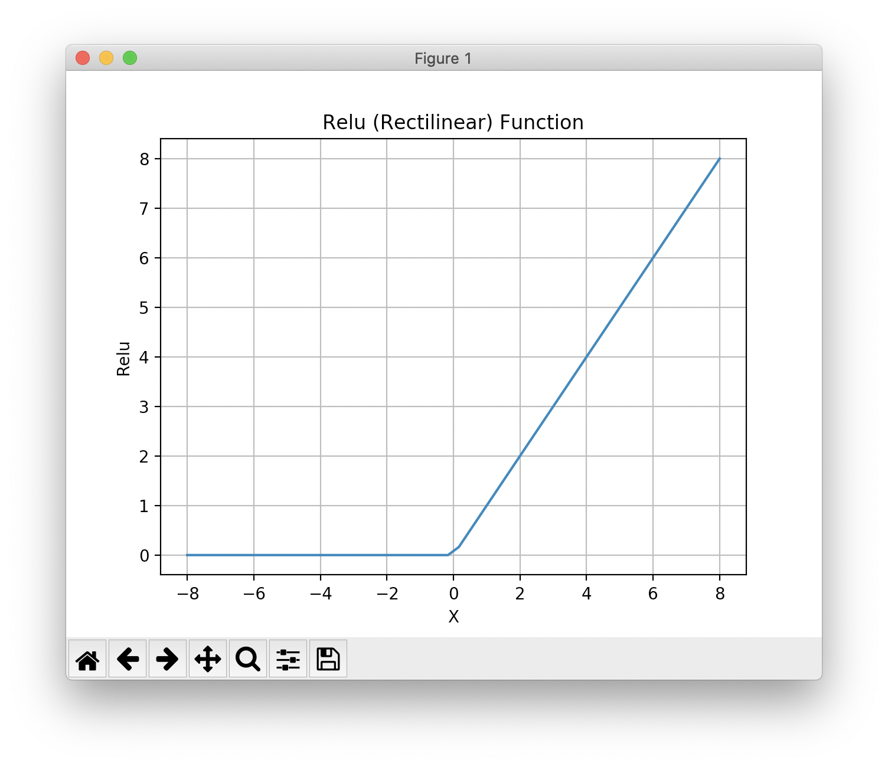

# Deep Learning

Most of my professional career since 2014 has involved Deep Learning, mostly with TensorFlow using the Keras APIs. In the late 1980s I was on a DARPA neural network technology advisory panel for a year, I wrote the first prototype of the SAIC ANSim neural network library commercial product, and I wrote the neural network prediction code for a bomb detector my company designed and built for the FAA for deployment in airports. More recently I have used GAN (generative adversarial networks) models for synthesizing numeric spreadsheet data and LSTM (long short term memory) models to synthesize highly structured text data like nested JSON and for NLP (natural language processing). I have several USA and European patents using neural network and Deep Learning technology.

The Hy language utilities and example programs we develop here all use TensorFlow and Keras "under the hood" to do the heavy lifting. Keras is a simpler to use API for TensorFlow and I usually use Keras rather than the lower level TensorFlow APIs.

There are other libraries and frameworks that might interest you in addition to TensorFlow and Keras. I particularly like the Flux library for the Julia programming language. Currently Python has the most comprehensive libraries for Deep Learning but other languages that support differential computing (more on this later) like Julia and Swift may gain popularity in the future.

Here we will learn a vocabulary for discussing Deep Learning neural network models, look at possible architectures, and show two Hy language examples that should be sufficient to get you used to using Keras with the Hy language. If you already have Deep Learning application development experience you might want to skip the following review material and skip to the Hy language examples.

If you want to use Deep Learning professionally, there are two specific online resources that I recommend: Andrew Ng leads the efforts at [deeplearning.ai](https://www.deeplearning.ai/) and Jeremy Howard leads the efforts at [fast.ai](https://www.fast.ai/). Here I will show you how to use a few useful techniques. Andrew and Jeremy will teach you skills that may lead a professional level of expertise if you take their courses.

There are many Deep Learning neural architectures in current practical use; a few types that I use are:

- Multi-layer perceptron networks with many fully connected layers. An input layer contains placeholders for input data. Each element in the input layer is connected by a two-dimensional weight matrix to each element in the first hidden layer. We can use any number of fully connected hidden layers, with the last hidden layer connected to an output layer.
- Convolutional networks for image processing and text classification. Convolutions, or filters, are small windows that can process input images (filters are two-dimensional) or sequences like text (filters are one-dimensional). Each filter uses a single set of learned weights independent of where the filter is applied in an input image or input sequence.
- Autoencoders have the same number of input layer and output layer elements with one or more hidden fully connected layers. Autoencoders are trained to produce the same output as training input values using a relatively small number of hidden layer elements. Autoencoders are capable of removing noise in input data.
- LSTM (long short term memory) process elements in a sequence in order and are capable of remembering patterns that they have seen earlier in the sequence.
- GAN (generative adversarial networks) models comprise two different and competing neural models, the generator and the discriminator. GANs are often trained on input images (although in my work I have applied GANs to two-dimensional numeric spreadsheet data). The generator model takes as input a "latent input vector" (this is just a vector of specific size with random values) and generates a random output image. The weights of the generator model are trained to produce random images that are similar to how training images look. The discriminator model is trained to recognize if an arbitrary output image is original training data or an image created by the generator model. The generator and discriminator models are trained together.

The core functionality of libraries like TensorFlow are written in C++ and take advantage of special hardware like GPUs, custom ASICs, and devices like Google's TPUs. Most people who work with Deep Learning models don't need to even be aware of the low level optimizations used to make training and using Deep Learning models more efficient. That said, in the following section I am going to show you how simple neural networks are trained and used.

## Simple Multi-layer Perceptron Neural Networks

I use the terms Multi-layer perceptron neural networks, backpropagation neural networks and delta-rule networks interchangeably. Backpropagation refers to the model training process of calculating the output errors when training inputs are passed in the forward direction from input layer, to hidden layers, and then to the output layer. There will be an error which is the difference between the calculated outputs and the training outputs. This error can be used to adjust the weights from the last hidden layer to the output layer to reduce the error. The error is then backprogated backwards through the hidden layers, updating all weights in the model. I have detailed example code in any of my older artificial intelligence books. Here I am satisfied to give you an intuition to how simple neural networks are trained.

The basic idea is that we start with a network initialized with random weights and for each training case we propagate the inputs through the network towards the output neurons, calculate the output errors, and back-up the errors from the output neurons back towards the input neurons in order to make small changes to the weights to lower the error for the current training example. We repeat this process by cycling through the training examples many times.

The following figure shows a simple backpropagation network with one hidden layer. Neurons in adjacent layers are connected by floating point connection strength weights. These weights start out as small random values that change as the network is trained. Weights are represented in the following figure by arrows; in the code the weights connecting the input to the output neurons are represented as a two-dimensional array.

{#nn-backprop}

Each non-input neuron has an activation value that is calculated from the activation values of connected neurons feeding into it, gated (adjusted) by the connection weights. For example, in the above figure, the value of Output 1 neuron is calculated by summing the activation of Input 1 times weight W1,1 and Input 2 activation times weight W2,1 and applying a "squashing function" like Sigmoid or Relu (see figures below) to this sum to get the final value for Output 1's activation value. We want to flatten activation values to a relatively small range but still maintain relative values. To do this flattening we use the Sigmoid function that is seen in the next figure, along with the derivative of the Sigmoid function which we will use in the code for training a network by adjusting the weights.

{#nn-sigmoid}

Simple neural network architectures with just one or two hidden layers are easy to train using backpropagation and I have from scratch code for this several of my previous books. However, here we are using Hy to write models using the TensorFlow framework which has the huge advantage that small models you experiment with on your laptop can be scaled to more parameters (usually this means more neurons in hidden layers which increases the number of weights in a model) and run in the cloud using multiple GPUs.

Except for pendantic purposes, I now never write neural network code from scratch, instead I take advantage of the many person-years of engineering work put into the development of frameworks like TensorFlow, PyTorch, mxnet, etc. We now move on to two examples built with TensorFlow.

## Deep Learning

Deep Learning models are generally understood to have many more hidden layers than simple multi-layer perceptron neural networks and often comprise multiple simple models combined together in series or in parallel.
Complex architectures can be iteratively developed by manually adjusting the size of model components, changing the components, etc. Alternatively, model architecture search can be automated. At Capital One I used Google's 
[AdaNet project](https://github.com/tensorflow/adanet) that efficiently searches for effective model architectures inside a single TensorFlow session. The model architecture used here is simple: one input layer representing the input values in a sample of University of Wisconsin cancer data, one hidden layer, and an output layer consisting of one neuron whose activation value will be interpreted as a prediction of benign or malignant.

The material in this chapter is intended to serve two purposes:

- If you are already familiar with Deep Learning and TensorFlow then the examples here will serve to show you how to call the TensorFlow APIs from Hy.
- If you have little or no exposure with Deep Learning then the short Hy language examples will provide you with concise code to experiment with and you can then decide to study further.

I recommend two online Deep Learning course sequences. For no cost, Jeremy Howard provides lessons at [fast.ai](https://fast.ai) that are very good and the later classes use PyTorch which is a framework that is similar to TensorFlow. For a modest cost Andrew Ng provides classes at [deeplearning.ai](https://www.deeplearning.ai/) that use TensorFlow. I have been working in the field of machine learning since the 1980s, but I still take Andrew's online classes to stay up-to-date. In the last eight years I have taken his Stanford University machine learning class twice and also his complete course sequence using TensorFlow. I have also worked through much of Jeremy's material. I recommend both course sequences without reservation.

## Using Keras and TensorFlow to Model The Wisconsin Cancer Data Set

The University of Wisconsin cancer database has 646 samples. Each sample has 9 input values and one output value, the target output class (0 for benign, 1 for cancer):

- 0 Clump Thickness               1 - 10
- 1 Uniformity of Cell Size       1 - 10
- 2 Uniformity of Cell Shape      1 - 10
- 3 Marginal Adhesion             1 - 10
- 4 Single Epithelial Cell Size   1 - 10
- 5 Bare Nuclei                   1 - 10
- 6 Bland Chromatin               1 - 10
- 7 Normal Nucleoli               1 - 10
- 8 Mitoses                       1 - 10
- 9 Class (0 for benign, 1 for malignant)

Here are a few samples:

{linenos=off}
~~~~~~~~
6,2,1,1,1,1,7,1,1,0
2,5,3,3,6,7,7,5,1,1
10,4,3,1,3,3,6,5,2,1
6,10,10,2,8,10,7,3,3,1
5,6,5,6,10,1,3,1,1,1
1,1,1,1,2,1,2,1,2,0
3,7,7,4,4,9,4,8,1,1
1,1,1,1,2,1,2,1,1,0
~~~~~~~~

After you look at this data, if you did not have much experience with machine learning then it might not be obvious how to build a model to accept a sample for a patient like we see in the Wisconsin data set and then predict if the sample implies benign or cancerous outcome for the patient. Using TensorFlow with a simple 
neural network model, we will implement a model in about 47 lines of Hy code (including 8 blank lines for readability, so it takes only 39 lines of code to implement this example.

Since there are nine input values we will need nine input neurons that will represent the input values for a sample in either training or separate test data. These nine input neurons (created in lines 9-10 in the following listing) will be completely connected to twelve neurons in a hidden layer. Here, completely connected means that each of the nine input neurons is connected via a weight to each hidden layer neuron. There are 9 * 12 = 108 weights between the input and hidden layers. There is a single output layer neuron that is connected to each hidden layer neuron.

TBD write code example, explain it here
