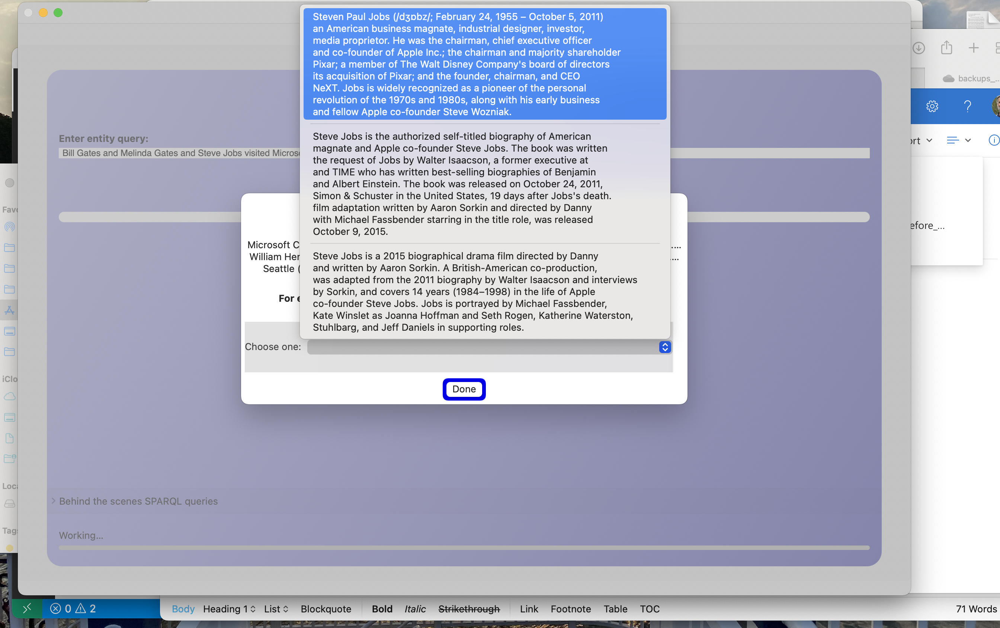
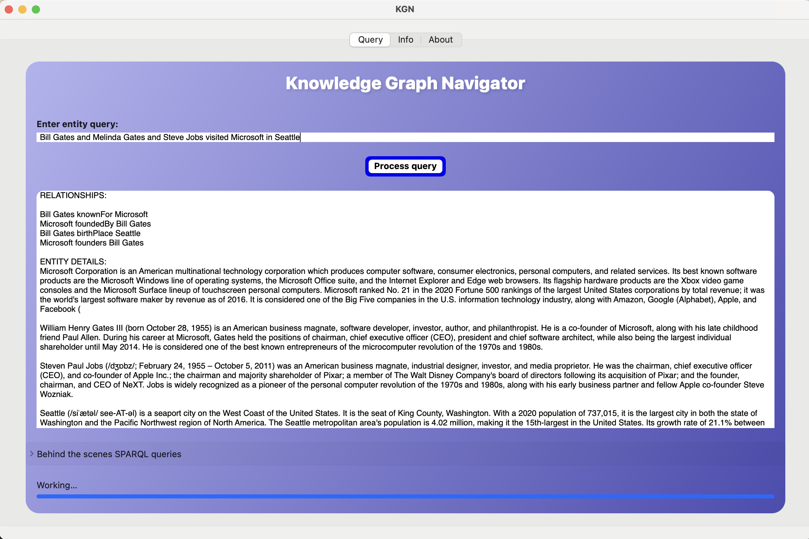
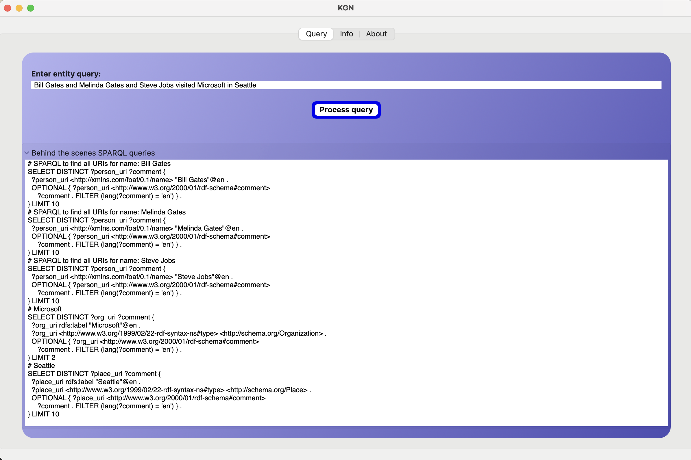

# Example Application: iOS and macOS Versions of my KnowledgeBookNavigator

I used many of the techniques discussed in this book, the Swift language, and the SwiftUI user interface framework to develop Swift version of my Knowledge Graph Navigator application for macOS. I originally wrote this as an example program in Common Lisp for another book project. 

The [GitHub repository for the KGN example is https://github.com/mark-watson/KGN](https://github.com/mark-watson/KGN). I copied the code from my stand-alone Swift libraries to this example to make it self contained. The easiest way to browse the source code is to open this project in Xcode.

I submitted the KGN app that we discuss in this chapter to Apple's store and is available as a macOS app. If you load this project into Xcode, you can also build and run the iOS and iPadOS targets.

You will need to have read through the last chapter on semantic web and linked data technologies to understand this example because quite a lot of the code has embedded SPARQL queries to get information from [DBPedia.org](https://dbpedia.org).

The other major part of this app is a slightly modified version of Apple's question answering (QA) example using the BERT model in CoreML. Apple's code is in the subdirectory **AppleBERT**. Please read the README file for this project and follow the directions for downloading and using Apple's model and vocabulary file.

## Screen Shots of macOS Application


In the first screenshot seen below, I had entered query text that included "Steve Jobs" and the popup list selector is used to let the user select which "Steve Jobs" entity from DBPedia that they want to use.

{width: "90%"}


{width: "90%"}


The previous screenshot shows the results to the query displayed as English text.

Notice the app prompt "Behind the scenes SPARQL queries" near the bottom of the app window. If you click on this field then the SPARQL queries used to answer the question are shown, as on the next screenshot:

{width: "90%"}



## Application Code Listings

I will list some of the code for this example application and I suggest that you, dear reader, also open this project in Xcode in order to navigate the sample code and more carefully read through it.

### SPARQL

I introduced you to the use of SPARQL in the last chapter. This library can be used by adding a reference to the **Project.swift** file for this project. You can also clone [the GitHub repository https://github.com/mark-watson/Nlp_swift](https://github.com/mark-watson/Nlp_swift) to have the source code for local viewing and modification and I have copied the code into the KGN project.

The file **SparqlQuery.swift** is shown here:

```swift
import Foundation

public func sparqlDbPedia(query: String) -> Array<Dictionary<String,String>> {
    return SparqlEndpointHelpter(query: query,
        endPointUri: "https://dbpedia.org/sparql?query=") }

public func sparqlWikidata(query: String) -> Array<Dictionary<String,String>> {
    return SparqlEndpointHelpter(query: query,
        endPointUri:
          "https://query.wikidata.org/bigdata/namespace/wdq/sparql?query=") }

public func SparqlEndpointHelpter(query: String,
                                  endPointUri: String) ->
                            Array<Dictionary<String,String>> {
    var ret = Set<Dictionary<String,String>>();
    var content = "{}"

    let maybeString = cacheLookupQuery7(key: query)
    if maybeString?.count ?? 0 > 0 {
        content = maybeString ?? ""
    } else {
        let requestUrl = URL(string: String(endPointUri + query.addingPercentEncoding(withAllowedCharacters:
          .urlHostAllowed)!) + "&format=json")!
        do { content = try String(contentsOf: requestUrl) }
          catch let error { print(error) }
    }
    let json = try? JSONSerialization.jsonObject(with: Data(content.utf8),
                                                 options: [])
    if let json2 = json as! Optional<Dictionary<String, Any?>> {
        if let head = json2["head"] as? Dictionary<String, Any> {
            if let xvars = head["vars"] as! NSArray? {
                if let results = json2["results"] as? Dictionary<String, Any> {
                    if let bindings = results["bindings"] as! NSArray? {
                        if bindings.count > 0 {
                            for i in 0...(bindings.count-1) {
                                if let first_binding =
                                bindings[i] as? Dictionary<String,
                                Dictionary<String,String>> {
                                    var ret2 = Dictionary<String,String>();
                                    for key in xvars {
                                        let key2 : String = key as! String
                                        if let vals = (first_binding[key2]) {
                                            let vv : String = vals["value"] ?? "err2"
                                            ret2[key2] = vv } }
                                    if ret2.count > 0 {
                                        ret.insert(ret2)
                                    }}}}}}}}}
    return Array(ret) }
```

The file **QueryCache.swift** contains code written by Khoa Pham (MIT License) that can be found in the GitHub repository [https://github.com/onmyway133/EasyStash](https://github.com/onmyway133/EasyStash). This file is used to cache SPARQL queries and the results. In testing this application I noticed that there were many repeated queries to DBPedia so I decided to cache results. Here is the simple API I added on top of Khoa Pham's code: 

```swift
//  Created by khoa on 27/05/2019.
//  Copyright © 2019 Khoa Pham. All rights reserved. MIT License.
//  https://github.com/onmyway133/EasyStash
//

import Foundation

//      Mark's simple wrapper:

var storage: Storage? = nil

public func cacheStoreQuery(key: String, value: String) {
    do { try storage?.save(object: value, forKey: key) } catch {}
}
public func cacheLookupQuery7(key: String) -> String? {
    // optional DEBUG code: clear cache
    //do { try storage?.removeAll() } catch { print("ERROR CLEARING CACHE") }
    do {
        return try storage?.load(forKey: key, as: String.self)
    } catch { return "" }
}

// remaining code not shown for brevity.
```

The code in file **GenerateSparql.swift** is used to generate queries for DBPedia. The line-wrapping for embedded SPARQL queries in the next code section is difficult to read so you may want to open the source file in Xcode. Please note that the KGN application prints out the SPARQL queries used to fetch information from DBPedia. The embedded SPARQL query templates used here have variable slots that filled in at runtime to customize the queries.

```swift
//
//  GenerateSparql.swift
//  KGNbeta1
//
//  Created by Mark Watson on 2/28/20.
//  Copyright © 2021 Mark Watson. All rights reserved.
//

import Foundation

public func uri_to_display_text(uri: String)
                                     -> String {
    return uri.replacingOccurrences(of: "http://dbpedia.org/resource/Category/",
        with: "").
      replacingOccurrences(of: "http://dbpedia.org/resource/",
        with: "").
         replacingOccurrences(of: "_", with: " ")
}

public func get_SPARQL_for_finding_URIs_for_PERSON_NAME(nameString: String)
                                              -> String {
    return
        "# SPARQL to find all URIs for name: " +
        nameString + "\nSELECT DISTINCT ?person_uri ?comment {\n" +
        "  ?person_uri <http://xmlns.com/foaf/0.1/name> \"" +
        nameString + "\"@en .\n" +
        "  OPTIONAL { ?person_uri <http://www.w3.org/2000/01/rdf-schema#comment>\n" +
        "     ?comment . FILTER (lang(?comment) = 'en') } .\n" +
        "} LIMIT 10\n"
}

public func get_SPARQL_for_PERSON_URI(aURI: String) -> String {
    return
        "# <" + aURI + ">\nSELECT DISTINCT ?comment (GROUP_CONCAT(DISTINCT ?birthplace; SEPARATOR=' | ') AS ?birthplace)\n  (GROUP_CONCAT(DISTINCT ?almamater; SEPARATOR=' | ') AS ?almamater) (GROUP_CONCAT(DISTINCT ?spouse; SEPARATOR=' | ') AS ?spouse) {\n" +
        "  <" + aURI + "> <http://www.w3.org/2000/01/rdf-schema#comment>  ?comment . FILTER  (lang(?comment) = 'en') .\n" +
        "  OPTIONAL { <" + aURI + "> <http://dbpedia.org/ontology/birthPlace> ?birthplace } .\n" +
        "  OPTIONAL { <" + aURI + "> <http://dbpedia.org/ontology/almaMater> ?almamater } .\n" +
        "  OPTIONAL { <" + aURI + "> <http://dbpedia.org/ontology/spouse> ?spouse } .\n" +
        "} LIMIT 5\n"
}

public func get_display_text_for_PERSON_URI(personURI: String) -> [String] {
    var ret: String = "\(uri_to_display_text(uri: personURI))\n\n"
    let person_details_sparql = get_SPARQL_for_PERSON_URI(aURI: personURI)
    let person_details = sparqlDbPedia(query: person_details_sparql)
    
    for pd in person_details {
        //let comment = pd["comment"]
        ret.append("\(pd["comment"] ?? "")\n\n")
        let subject_uris = pd["subject_uris"]
        let uri_list: [String] = subject_uris?.components(separatedBy: " | ") ?? []
        //ret.append("<ul>\n")
        for u in uri_list {
            let subject = uri_to_display_text(uri: u)
            ret.append("\(subject)\n") }
        //ret.append("</ul>\n")
        if let spouse = pd["spouse"] {
            if spouse.count > 0 {
                ret.append("Spouse: \(uri_to_display_text(uri: spouse))\n") } }
        if let almamater = pd["almamater"] {
            if almamater.count > 0 {
                ret.append("Almamater: \(uri_to_display_text(uri: almamater))\n") } }
        if let birthplace = pd["birthplace"] {
            if birthplace.count > 0 {
                ret.append("Birthplace: \(uri_to_display_text(uri: birthplace))\n") } }
    }
    return ["# SPARQL for a specific person:\n" + person_details_sparql, ret]
}

//     "  ?place_uri <http://xmlns.com/foaf/0.1/name> \"" + placeString + "\"@en .\n" +

public func get_SPARQL_for_finding_URIs_for_PLACE_NAME(placeString: String)
                                               -> String {
    return
        "# " + placeString + "\nSELECT DISTINCT ?place_uri ?comment {\n" +
        "  ?place_uri rdfs:label \"" + placeString + "\"@en .\n" +
        "  ?place_uri <http://www.w3.org/1999/02/22-rdf-syntax-ns#type> <http://schema.org/Place> .\n" +
        "  OPTIONAL { ?place_uri <http://www.w3.org/2000/01/rdf-schema#comment>\n" +
        "     ?comment . FILTER (lang(?comment) = 'en') } .\n" +
        "} LIMIT 10\n"
}

public func get_SPARQL_for_PLACE_URI(aURI: String) -> String {
    return
        "# <" + aURI + ">\nSELECT DISTINCT ?comment (GROUP_CONCAT(DISTINCT ?subject_uris; SEPARATOR=' | ') AS ?subject_uris) {\n" +
        "  <" + aURI + "> <http://www.w3.org/2000/01/rdf-schema#comment>  ?comment . FILTER  (lang(?comment) = 'en') .\n" +
        "  OPTIONAL { <" + aURI + "> <http://purl.org/dc/terms/subject> ?subject_uris } .\n" +
        "} LIMIT 5\n"
}

public func get_HTML_for_place_URI(placeURI: String) -> String {
    var ret: String = "<h2>" + placeURI + "</h2>\n"
    let place_details_sparql = get_SPARQL_for_PLACE_URI(aURI: placeURI)
    let place_details = sparqlDbPedia(query: place_details_sparql)
    
    for pd in place_details {
        //let comment = pd["comment"]
        ret.append("<p><strong>\(pd["comment"] ?? "")</strong></p>\n")
        let subject_uris = pd["subject_uris"]
        let uri_list: [String] = subject_uris?.components(separatedBy: " | ") ?? []
        ret.append("<ul>\n")
        for u in uri_list {
            let subject = u.replacingOccurrences(of: "http://dbpedia.org/resource/Category:", with: "").replacingOccurrences(of: "_", with: " ").replacingOccurrences(of: "-", with: " ")
            ret.append("  <li>\(subject)</li>\n")
        }
        ret.append("</ul>\n")
    }
    return ret
}

public func get_SPARQL_for_finding_URIs_for_ORGANIZATION_NAME(orgString: String) -> String {
    return
        "# " + orgString + "\nSELECT DISTINCT ?org_uri ?comment {\n" +
        "  ?org_uri rdfs:label \"" + orgString + "\"@en .\n" +
        "  ?org_uri <http://www.w3.org/1999/02/22-rdf-syntax-ns#type> <http://schema.org/Organization> .\n" +
        "  OPTIONAL { ?org_uri <http://www.w3.org/2000/01/rdf-schema#comment>\n" +
        "     ?comment . FILTER (lang(?comment) = 'en') } .\n" +
        "} LIMIT 2\n"
}
```

The file **AppSparql** contains more utility functions for getting entity and relationship data from DBPedia:

```swift
//  AppSparql.swift
//  Created by ML Watson on 7/18/21.

import Foundation

let detailSparql = """
PREFIX rdfs: <http://www.w3.org/2000/01/rdf-schema#>
select ?entity ?label ?description ?comment where {
    ?entity rdfs:label "<name>"@en .
    ?entity schema:description ?description . filter (lang(?description) = 'en') . filter(!regex(?description,"Wikimedia disambiguation page")) .
 } limit 5000
"""

let personSparql = """
  select ?uri ?comment {
      ?uri <http://xmlns.com/foaf/0.1/name> "<name>"@en .
      ?uri <http://www.w3.org/2000/01/rdf-schema#comment>  ?comment .
          FILTER  (lang(?comment) = 'en') .
  }
"""


let personDetailSparql = """
SELECT DISTINCT ?label ?comment
                     
     (GROUP_CONCAT (DISTINCT ?birthplace; SEPARATOR=' | ') AS ?birthplace)
     (GROUP_CONCAT (DISTINCT ?almamater; SEPARATOR=' | ') AS ?almamater)
     (GROUP_CONCAT (DISTINCT ?spouse; SEPARATOR=' | ') AS ?spouse) {
       <name> <http://www.w3.org/2000/01/rdf-schema#comment>  ?comment .
       FILTER  (lang(?comment) = 'en') .
     OPTIONAL { <name> <http://dbpedia.org/ontology/birthPlace> ?birthplace } .
     OPTIONAL { <name> <http://dbpedia.org/ontology/almaMater> ?almamater } .
     OPTIONAL { <name> <http://dbpedia.org/ontology/spouse> ?spouse } .
     OPTIONAL { <name>  <http://www.w3.org/2000/01/rdf-schema#label> ?label .
        FILTER  (lang(?label) = 'en') }
} LIMIT 10
"""

let placeSparql = """
SELECT DISTINCT ?uri ?comment WHERE {
   ?uri rdfs:label "<name>"@en .
   ?uri <http://www.w3.org/2000/01/rdf-schema#comment>  ?comment .
   FILTER (lang(?comment) = 'en') .
   ?place <http://www.w3.org/1999/02/22-rdf-syntax-ns#type> <http://schema.org/Place> .
} LIMIT 80
"""

let organizationSparql = """
SELECT DISTINCT ?uri ?comment WHERE {
   ?uri rdfs:label "<name>"@en .
   ?uri <http://www.w3.org/2000/01/rdf-schema#comment>  ?comment .
   FILTER (lang(?comment) = 'en') .
   ?uri <http://www.w3.org/1999/02/22-rdf-syntax-ns#type> <http://schema.org/Organization> .
} LIMIT 80
"""

func entityDetail(name: String) -> [Dictionary<String,String>] {
    var ret: [Dictionary<String,String>] = []
    let sparql = detailSparql.replacingOccurrences(of: "<name>", with: name)
    print(sparql)
    let r = sparqlDbPedia(query: sparql)
    r.forEach { result in
        print(result)
        ret.append(result)
    }
    return ret
}

func personDetail(name: String) -> [Dictionary<String,String>] {
    var ret: [Dictionary<String,String>] = []
    let sparql = personSparql.replacingOccurrences(of: "<name>", with: name)
    print(sparql)
    let r = sparqlDbPedia(query: sparql)
    r.forEach { result in
        print(result)
        ret.append(result)
    }
    return ret
}

func placeDetail(name: String) -> [Dictionary<String,String>] {
    var ret: [Dictionary<String,String>] = []
    let sparql = placeSparql.replacingOccurrences(of: "<name>", with: name)
    print(sparql)
    let r = sparqlDbPedia(query: sparql)
    r.forEach { result in
        print(result)
        ret.append(result)
    }
    return ret
}

func organizationDetail(name: String) -> [Dictionary<String,String>] {
    var ret: [Dictionary<String,String>] = []
    let sparql = organizationSparql.replacingOccurrences(of: "<name>", with: name)
    print(sparql)
    let r = sparqlDbPedia(query: sparql)
    r.forEach { result in
        print(result)
        ret.append(result)
    }
    return ret
}

public func processEntities(inputString: String) -> [(name: String, type: String, uri: String, comment: String)] {
    let entities = getEntities(text: inputString)
    var augmentedEntities: [(name: String, type: String, uri: String, comment: String)] = []
    for (entityName, entityType) in entities {
        print("** entityName:", entityName, "entityType:", entityType)
        if entityType == "PersonalName" {
            let data = personDetail(name: entityName)
            for d in data {
                augmentedEntities.append((name: entityName, type: entityType,
                    uri: "<" + d["uri"]! + ">", comment: "<" + d["comment"]! + ">"))
            }
        }
        if entityType == "OrganizationName" {
            let data = organizationDetail(name: entityName)
            for d in data {
                augmentedEntities.append((name: entityName, type: entityType,
                    uri: "<" + d["uri"]! + ">", comment: "<" + d["comment"]! + ">"))
            }
        }
        if entityType == "PlaceName" {
            let data = placeDetail(name: entityName)
            for d in data {
                augmentedEntities.append((name: entityName, type: entityType,
                    uri: "<" + d["uri"]! + ">", comment: "<" + d["comment"]! + ">"))
            }
        }
    }
    return augmentedEntities
}


extension Array where Element: Hashable {
    func uniqueValuesHelper() -> [Element] {
        var addedDict = [Element: Bool]()
        return filter { addedDict.updateValue(true, forKey: $0) == nil }
    }
    mutating func uniqueValues() {
        self = self.uniqueValuesHelper()
    }
}


func getAllRelationships(inputString: String) -> [String] {
    let augmentedEntities = processEntities(inputString: inputString)
    var relationshipTriples: [String] = []
    for ae1 in augmentedEntities {
        for ae2 in augmentedEntities {
            if ae1 != ae2 {
                let er1 = dbpediaGetRelationships(entity1Uri: ae1.uri,
                                                  entity2Uri: ae2.uri)
                relationshipTriples.append(contentsOf: er1)
                let er2 = dbpediaGetRelationships(entity1Uri: ae2.uri,
                                                  entity2Uri: ae1.uri)
                relationshipTriples.append(contentsOf: er2)
            }
        }
    }
    relationshipTriples.uniqueValues()
    relationshipTriples.sort()
    return relationshipTriples
}
```

### AppleBERT

The files in the directory AppleBERT were copied from Apple's example [https://developer.apple.com/documentation/coreml/model_integration_samples/finding_answers_to_questions_in_a_text_document](https://developer.apple.com/documentation/coreml/model_integration_samples/finding_answers_to_questions_in_a_text_document) with a few changes to get returned results in a convenient format for this application. Apple's BERT documentation is excellent and you should review it.

### Relationships

The file **Relationships.swift** fetches relationship data for pairs of DBPedia entities. Note that the first SPARQL template has variable slots **<e1>** and **<e2>** that are replaced at runtime with URIs representing the entities that we are searching for relationships between these two entities:

```swift
// relationships between DBPedia entities

let relSparql =  """
SELECT DISTINCT ?p {<e1> ?p <e2> .FILTER (!regex(str(?p), 'wikiPage', 'i'))} LIMIT 5
"""

public func dbpediaGetRelationships(entity1Uri: String, entity2Uri: String)
                                      -> [String] {
    var ret: [String] = []
    let sparql1 = relSparql.replacingOccurrences(of: "<e1>",
      with: entity1Uri).replacingOccurrences(of: "<e2>",
        with: entity2Uri)
    let r1 = sparqlDbPedia(query: sparql1)
    r1.forEach { result in
        if let relName = result["p"] {
            let rdfStatement = entity1Uri + " <" + relName + "> " + entity2Uri + " ."
            print(rdfStatement)
            ret.append(rdfStatement)
        }
    }
    let sparql2 = relSparql.replacingOccurrences(of: "<e1>",
        with: entity2Uri).replacingOccurrences(of: "<e2>",
            with: entity1Uri)
    let r2 = sparqlDbPedia(query: sparql2)
    r2.forEach { result in
        if let relName = result["p"] {
            let rdfStatement = entity2Uri + " <" + relName + "> " + entity1Uri + " ."
            print(rdfStatement)
            ret.append(rdfStatement)
        }
    }
    return Array(Set(ret))
}

public func uriToPrintName(_ uri: String) -> String {
    let slashIndex = uri.lastIndex(of: "/")
    if slashIndex == nil { return uri }
    var s = uri[slashIndex!...]
    s = s.dropFirst()
    if s.count > 0 { s.removeLast() }
    return String(s).replacingOccurrences(of: "_", with: " ")
}

public func relationshipsoEnglish(rs: [String]) -> String {
    var lines: [String] = []
    for r in rs {
        let triples = r.split(separator: " ", maxSplits: 3,
            omittingEmptySubsequences: true)
        if triples.count > 2 {
            lines.append(uriToPrintName(String(triples[0])) + " " +
              uriToPrintName(String(triples[1])) + " " +
                uriToPrintName(String(triples[2])))
        } else {
            lines.append(r)
        }
    }
    let linesNoDuplicates = Set(lines)
    return linesNoDuplicates.joined(separator: "\n")
}
```

### NLP

The file **NlpWhiteboard** provides high level NLP utility functions for the application:

```swift
//
//  NlpWhiteboard.swift
//  KGN
//
//  Copyright © 2021 Mark Watson. All rights reserved.
//

public struct NlpWhiteboard {

    var originalText: String = ""
    var people: [String] = []
    var places: [String] = []
    var organizations: [String] = []
    var sparql: String = ""

    init() { }

    mutating func set_text(originalText: String) {
        self.originalText = originalText
        let (people, places, organizations) = getAllEntities(text:  originalText)
        self.people = people; self.places = places; self.organizations = organizations
    }
    
    mutating func query_to_choices(behindTheScenesSparqlText: inout String)
          -> [[[String]]] { // return inner: [comment, uri]
        var ret: Set<[[String]]> = []
        if people.count > 0 {
            for i in 0...(people.count - 1) {
                self.sparql =
                  get_SPARQL_for_finding_URIs_for_PERSON_NAME(nameString: people[i])
                behindTheScenesSparqlText += self.sparql
                let results = sparqlDbPedia(query: self.sparql)
                if results.count > 0 {
                    ret.insert( results.map { [($0["comment"]
                                                ?? ""),
                                                ($0["person_uri"] ?? "")] })
                }
            }
        }
        if organizations.count > 0 {
            for i in 0...(organizations.count - 1) {
                self.sparql = get_SPARQL_for_finding_URIs_for_ORGANIZATION_NAME(
                    orgString: organizations[i])
                behindTheScenesSparqlText += self.sparql
                let results = sparqlDbPedia(query: self.sparql)
                if results.count > 0 {
                    ret.insert(results.map { [($0["comment"] ??
                      ""), ($0["org_uri"] ?? "")] })
                }
            }
        }
        if places.count > 0 {
            for i in 0...(places.count - 1) {
                self.sparql = get_SPARQL_for_finding_URIs_for_PLACE_NAME(
                    placeString: places[i])
                behindTheScenesSparqlText += self.sparql
                let results = sparqlDbPedia(query: self.sparql)
                if results.count > 0 {
                    ret.insert( results.map { [($0["comment"] ??
                      ""), ($0["place_uri"] ?? "")] })
                }
            }
        }
        //print("\n\n+++++++ ret:\n", ret, "\n\n")
        return Array(ret)
    }
}
```

The file **NLPutils.swift** provides lower level NLP utilities:

```swift
//  NLPutils.swift
//  KGN
//
//  Copyright © 2021 Mark Watson. All rights reserved.
//

import Foundation
import NaturalLanguage

public func getPersonDescription(personName: String) -> [String] {
    let sparql = get_SPARQL_for_finding_URIs_for_PERSON_NAME(nameString: personName)
    let results = sparqlDbPedia(query: sparql)
    return [sparql, results.map {
      ($0["comment"] ?? $0["abstract"] ?? "") }.joined(separator: " . ")]
}


public func getPlaceDescription(placeName: String) -> [String] {
    let sparql = get_SPARQL_for_finding_URIs_for_PLACE_NAME(placeString: placeName)
    let results = sparqlDbPedia(query: sparql)
    return [sparql, results.map { ($0["comment"] ??
        $0["abstract"] ?? "") }.joined(separator: " . ")]
}

public func getOrganizationDescription(organizationName: String) -> [String] {
    let sparql = get_SPARQL_for_finding_URIs_for_ORGANIZATION_NAME(
        orgString: organizationName)
    let results = sparqlDbPedia(query: sparql)
    print("=== getOrganizationDescription results =\n", results)
    return [sparql, results.map { ($0["comment"] ?? $0["abstract"] ?? "") }
        .joined(separator: " . ")]
}

let tokenizer = NLTokenizer(unit: .word)
let tagger = NSLinguisticTagger(tagSchemes:[.tokenType, .language, .lexicalClass,
  .nameType, .lemma], options: 0)
let options: NSLinguisticTagger.Options =
    [.omitPunctuation, .omitWhitespace, .joinNames]

let tokenizerOptions: NSLinguisticTagger.Options =
    [.omitPunctuation, .omitWhitespace, .joinNames]

public func getEntities(text: String) -> [(String, String)] {
    var words: [(String, String)] = []
    tagger.string = text
    let range = NSRange(location: 0, length: text.utf16.count)
    tagger.enumerateTags(in: range, unit: .word,
        scheme: .nameType, options: options) { tag, tokenRange, stop in
        let word = (text as NSString).substring(with: tokenRange)
        let tagType = tag?.rawValue ?? "unkown"
        if tagType != "unkown" && tagType != "OtherWord" {
            words.append((word, tagType))
        }
    }
    return words
}

public func tokenizeText(text: String) -> [String] {
    var tokens: [String] = []
    tokenizer.string = text
    tokenizer.enumerateTokens(in: text.startIndex..<text.endIndex) { tokenRange, _ in
        tokens.append(String(text[tokenRange]))
        return true
    }
    return tokens
}

let entityTagger = NLTagger(tagSchemes: [.nameType])
let entityOptions: NLTagger.Options = [.omitPunctuation, .omitWhitespace, .joinNames]
let entityTagTypess: [NLTag] = [.personalName, .placeName, .organizationName]

public func getAllEntities(text: String) -> ([String],[String],[String]) {
    var words: [(String, String)] = []
    var people: [String] = []
    var places: [String] = []
    var organizations: [String] = []
    entityTagger.string = text
    entityTagger.enumerateTags(in: text.startIndex..<text.endIndex, unit: .word,
        scheme: .nameType, options: entityOptions) { tag, tokenRange in
        if let tag = tag, entityTagTypess.contains(tag) {
            let word = String(text[tokenRange])
            if tag.rawValue == "PersonalName" {
                people.append(word)
            } else if tag.rawValue == "PlaceName" {
                places.append(word)
            } else if tag.rawValue == "OrganizationName" {
                organizations.append(word)
            } else {
                print("\nERROR: unkown entity type: |\(tag.rawValue)|")
            }
            words.append((word, tag.rawValue))
        }
        return true
    }
    return (people, places, organizations)
}

func splitLongStrings(_ s: String, limit: Int) -> String {
    var ret: [String] = []
    let tokens = s.split(separator: " ")
    var subLine = ""
    for token in tokens {
        if subLine.count > limit {
            ret.append(subLine)
            subLine = ""
        } else {
            subLine = subLine + " " + token
        }
    }
    if subLine.count > 0 {
        ret.append(subLine)
    }
    return ret.joined(separator: "\n")
}
```


### Views

This is not a book about SwiftUI programming, and indeed I expect many of you dear readers know much more about UI development with SwiftUI than I do. I am not going to list the four view files:

- MainView.swift
- QueryView.swift
- AboutView.swift
- InfoView.swift

### Main KGN

The top level app code in the file **KGNApp.swift** is fairly simple. I hardcoded the window size for macOS and the window sizes for running this example on iPadOS or iOS are commented out:

```swift
import SwiftUI

@main
struct KGNApp: App {
    var body: some Scene {
        WindowGroup {
          MainView()
            .frame(width: 1200, height: 770)    // << here !!
            //.frame(width: 660, height: 770)    // << here !!
            //..frame(width: 500, height: 800)    // << here !!
        }
    }
}
```

I was impressed by the SwiftUI framework. Applications are fairly portable across macOS, iOS, and iPadOS. I am not a UI developer by profession (as this application shows) but I enjoyed learning just enough about SwiftUI to write this example application.
