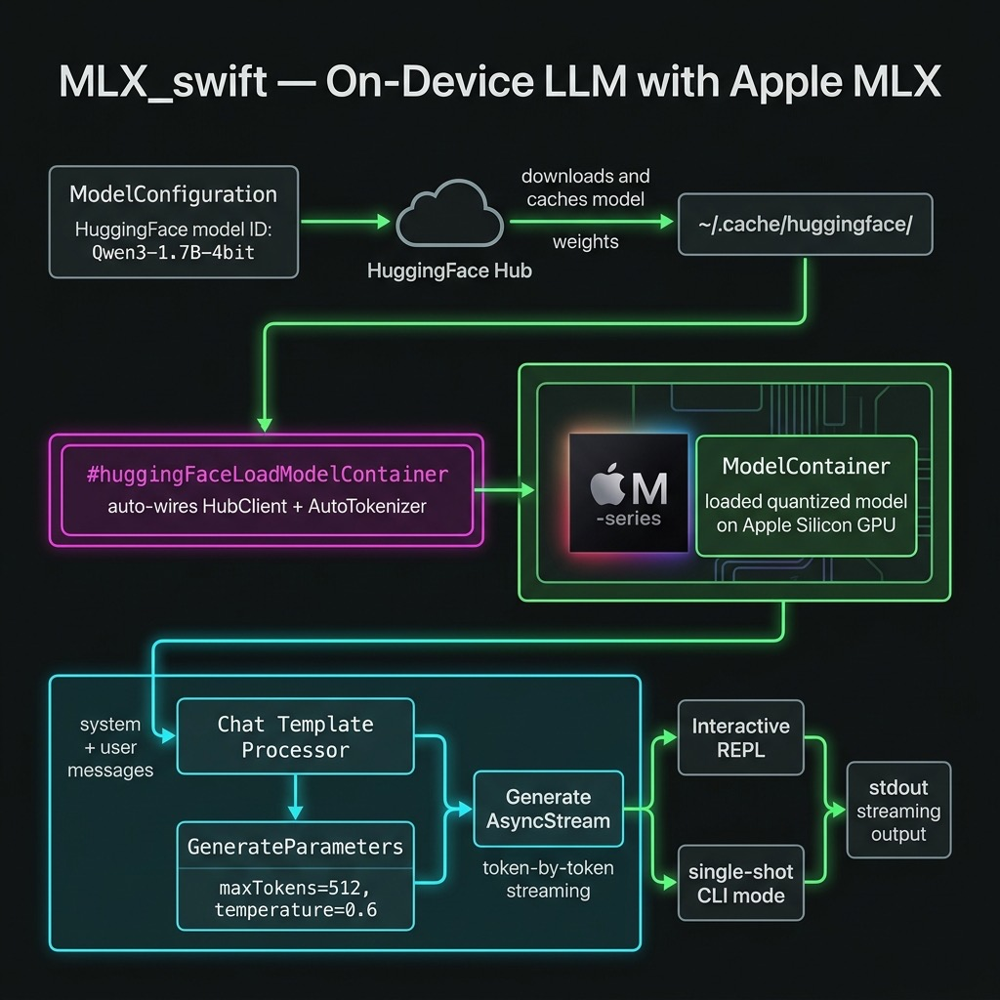

# Running Local LLMs with Apple's MLX Framework

Apple's **MLX** framework lets you run large language models
entirely on-device on Apple Silicon, with no network calls and no
API keys. Because the CPU, GPU, and Neural Engine all share the same
unified memory pool, data never has to be copied between chips.
The result is fast, low-overhead inference that works offline and
keeps user data private.

This chapter walks through a standalone Swift command-line tool in
**source-code/MLX_swift/** that downloads a small quantised language
model on the first run, caches it locally, and exposes both a
single-prompt mode and an interactive REPL.

## Background: MLX and Apple Silicon

Apple introduced MLX in December 2023 as an open-source,
NumPy-like array framework tuned for Apple Silicon's unified memory
architecture. The key insight is that the M-series chips give every
compute unit — CPU, GPU, and Neural Engine — a single view of RAM.
There is no host-to-device copy step before inference begins, which
eliminates a major bottleneck that exists on discrete-GPU systems.

MLX is available in Python and Swift. The **mlx-swift-lm**
repository provides the higher-level Swift libraries used in this
chapter:

| Library | Purpose |
|---|---|
| `MLXLLM` | Load and run text-only language models |
| `MLXVLm` | Vision-language models (image + text) |
| `MLXLMCommon` | Shared types: `ModelContainer`, `GenerateParameters`, `generate()` |
| `MLXHuggingFace` | Swift macros for one-step model loading from Hugging Face |

> **Note:** The `mlx-swift-lm` repository (reusable libraries)
> is separate from `mlx-swift-examples` (demo apps). Always
> depend on `mlx-swift-lm` for library code.

## Choosing a Model

Any 4-bit quantised model published by the
[mlx-community](https://huggingface.co/mlx-community) organisation
on Hugging Face can be used with this code. The model is specified
by its Hugging Face repository ID. The example uses:

```
mlx-community/Qwen3-1.7B-4bit
```

**Qwen3-1.7B-4bit** is about 1 GB on disk. It runs comfortably on
a Mac with 8 GB of unified memory and produces good-quality,
instruction-following output. Other good choices for experimentation:

| Model ID | Disk | Notes |
|---|---|---|
| `mlx-community/Qwen3-1.7B-4bit` | ~1 GB | Default in this example |
| `mlx-community/Llama-3.2-1B-Instruct-4bit` | ~0.8 GB | Meta Llama |
| `mlx-community/Phi-4-mini-instruct-4bit` | ~2.5 GB | Microsoft Phi-4 Mini |
| `mlx-community/Qwen3-8B-4bit` | ~5 GB | Larger Qwen3 |

Models are downloaded on the first run and cached in
`~/.cache/huggingface/`. Subsequent runs start immediately from the
local cache.

## Project Structure

```
source-code/MLX_swift/
├── build.sh              # build + compile Metal shaders + run
├── Package.swift
└── Sources/MLX_swift/
    └── main.swift
```

The logic lives entirely in `main.swift`. `build.sh` handles the
Metal shader compilation step that `swift build` skips (see
"Running the Example" below).



## Package.swift

```swift
// swift-tools-version: 6.0
import PackageDescription

let package = Package(
    name: "MLX_swift",
    platforms: [.macOS(.v14)],
    dependencies: [
        .package(
            url: "https://github.com/ml-explore/mlx-swift-lm",
            branch: "main"
        ),
        .package(
            url:
                "https://github.com/huggingface/swift-transformers",
            from: "1.0.0"
        ),
    ],
    targets: [
        .executableTarget(
            name: "MLX_swift",
            dependencies: [
                .product(
                    name: "MLXLLM",
                    package: "mlx-swift-lm"),
                .product(
                    name: "MLXLMCommon",
                    package: "mlx-swift-lm"),
                .product(
                    name: "MLXHuggingFace",
                    package: "mlx-swift-lm"),
                .product(
                    name: "Transformers",
                    package: "swift-transformers"),
            ],
            path: "Sources/MLX_swift"
        )
    ]
)
```

**Why two repositories?** `mlx-swift-lm` provides `MLXLLM`,
`MLXLMCommon`, and `MLXHuggingFace`. The `MLXHuggingFace` Swift
macros expand to code that references `HuggingFace.HubClient` and
`Tokenizers.AutoTokenizer` at the call site — types that live in
`swift-transformers`, not `mlx-swift-lm`. Both packages must
therefore be explicit dependencies and imported in `main.swift`.

## main.swift — Full Walkthrough

### Imports

```swift
import Foundation
import HuggingFace
import Tokenizers
import MLXLLM
import MLXLMCommon
import MLXHuggingFace
```

`HuggingFace` and `Tokenizers` come from `swift-transformers` and
are required so that the `#huggingFaceLoadModelContainer` macro can
find `HubClient` and `AutoTokenizer` when it expands.

### Configuration Constants

```swift
let modelID = "mlx-community/Qwen3-1.7B-4bit"
let temperature: Float = 0.6
let maxTokens = 512
```

All three values are at the top of the file so they are easy to
change. Swap `modelID` to try a different model. Reduce
`temperature` toward 0.0 for more deterministic output; increase it
toward 1.0 for more creative responses.

### Loading the Model

```swift
let config = ModelConfiguration(id: modelID)

let container: ModelContainer
do {
    container = try await #huggingFaceLoadModelContainer(
        configuration: config
    ) { progress in
        let pct = Int(progress.fractionCompleted * 100)
        print("\r  Downloading \(config.name): \(pct)%  ",
              terminator: "")
        fflush(stdout)
    }
} catch {
    fputs("[Error] Failed to load model: \(error)\n", stderr)
    exit(1)
}
```

`ModelConfiguration(id:)` creates a descriptor from a Hugging Face
repository ID. `#huggingFaceLoadModelContainer` is a Swift macro
from the `MLXHuggingFace` library. It automatically wires up:
- a `HubClient` downloader (pulls weights from Hugging Face)
- an `AutoTokenizer` loader (picks the right tokenizer for the model)

If the weights are already in `~/.cache/huggingface/` the progress
closure is never called. If they are not, it fires repeatedly as
each weight shard downloads. The returned `ModelContainer` owns the
loaded weights and tokenizer for the lifetime of the process.

### Preparing Input and Generating

```swift
let result =
    try await container.perform { context in

    let messages: [[String: String]] = [
        ["role": "system",
         "content": "You are a helpful assistant."],
        ["role": "user",
         "content": userPrompt]
    ]
    let input = try await context.processor.prepare(
        input: .init(messages: messages))

    var output = ""
    let stream = try generate(
        input: input,
        parameters: GenerateParameters(
            maxTokens: maxTokens,
            temperature: temperature),
        context: context)

    for await generation in stream {
        switch generation {
        case .chunk(let text):
            print(text, terminator: "")
            fflush(stdout)
            output += text
        case .info:
            break   // timing summary — ignore here
        case .toolCall:
            break   // tool calls unused in this demo
        }
    }
    return output
}
```

**Why `context.processor.prepare`?** Different model families
(Llama, Qwen, Phi, Gemma, …) each have their own chat template.
Calling `processor.prepare` applies the correct template
automatically — you never hard-code `<|im_start|>user` or
`[INST]` by hand.

**`generate(input:parameters:context:)`** returns an
`AsyncStream<Generation>`. Each element is one of:
- `.chunk(String)` — a decoded text fragment to stream to the user
- `.info(GenerateCompletionInfo)` — a timing summary at the end
- `.toolCall(ToolCall)` — a function-call request (unused here)

**Note on argument order:** `GenerateParameters` requires
`maxTokens` before `temperature` — swapping them is a compile
error.

**`container.perform`** acquires the model's internal lock before
running, preventing concurrent callers from corrupting shared GPU
memory. It is the correct way to interact with a `ModelContainer`
from an async context.

### Async Entry Point

Because `main.swift` cannot be `async` at the top level without
the `@main` attribute, all async work is wrapped in a `Task`:

```swift
let mainTask = Task {
    // … all async code …
}
_ = await mainTask.value
```

This avoids the `@main` struct boilerplate while still letting the
process properly await completion before exiting.

### Interactive REPL

```swift
while true {
    print("You: ", terminator: "")
    fflush(stdout)

    guard let line = readLine(strippingNewline: true),
          !line.isEmpty else { continue }

    if line.lowercased() == "quit"
        || line.lowercased() == "q" {
        print("Goodbye!")
        break
    }
    await runPrompt(line)
}
```

Each turn is independent: the model has no memory of previous turns.
Adding conversation history requires accumulating the messages array
across turns and passing the full history to `processor.prepare`.

## Running the Example

### Prerequisites

- **macOS 14 (Sonoma)** or later
- **Apple Silicon** (M1, M2, M3, M4, or later)
- **Xcode 16** or the Xcode 16 command-line tools
- **Metal Toolchain** — download once (see below)
- Internet access for the first run (model download)

### One-Time Metal Toolchain Setup

MLX's GPU kernels are Metal shaders that must be compiled into a
`mlx.metallib` file. Xcode handles this automatically for app
targets, but `swift build` does not. The `build.sh` script
compiles the shaders using `xcrun metal`, which requires the Metal
Toolchain to be installed. Download it once:

```bash
xcodebuild -downloadComponent MetalToolchain
```

### Single Prompt

```bash
cd source-code/MLX_swift
./build.sh "Explain unified memory in one sentence."
```

### Interactive REPL

```bash
cd source-code/MLX_swift
./build.sh --repl
```

### Build Only (then run manually)

```bash
./build.sh
.build/arm64-apple-macosx/release/MLX_swift "add 1 + 13"
```

The first `./build.sh` call compiles all Metal shaders (~39 files)
and links `mlx.metallib`. Subsequent calls skip the shader step
because the file already exists.

### First-Run Output

The first time you run the tool the weights are downloaded from
Hugging Face. Subsequent runs are instant because the weights are
cached:

```
╔══════════════════════════════════════════════╗
║       MLX Swift — Local LLM on Device        ║
╚══════════════════════════════════════════════╝
Model : mlx-community/Qwen3-1.7B-4bit
Tokens: up to 512 per response

Loading model …
  Downloading Qwen3-1.7B-4bit: 100%
Model ready.

User: add 1 + 13
Assistant: 1 + 13 = 14.
```

## Swapping Models

To try a different model, change the single constant at the top of
`main.swift`:

```swift
let modelID = "mlx-community/Phi-4-mini-instruct-4bit"
```

No other code changes are needed. `ModelConfiguration(id:)` and
`#huggingFaceLoadModelContainer` handle downloading the matching
tokeniser configuration and model weights automatically.

## Key Takeaways

1. **Unified memory = no copy overhead.** Apple Silicon's shared
   memory pool lets MLX move tensors between CPU and GPU without
   any marshalling step.

2. **`#huggingFaceLoadModelContainer`** handles the download,
   caching, and model initialisation in a single macro call.
   It requires `import HuggingFace` and `import Tokenizers`
   at the call site because the macro expands to code that
   references those types directly.

3. **`context.processor.prepare`** applies the model-specific chat
   template automatically so you never need to hard-code prompt
   formats.

4. **`generate(input:parameters:context:)`** streams decoded text
   via an `AsyncStream<Generation>`. Switch on `.chunk`, `.info`,
   and `.toolCall` cases to handle each event type.

5. **`container.perform`** serialises concurrent callers so that
   GPU memory is not corrupted by overlapping inference.

6. **`swift build` / `swift run` alone is not enough.** Metal
   shaders must be compiled separately. Use `build.sh`, which
   invokes `xcrun metal` and `xcrun metallib` to produce
   `mlx.metallib` next to the binary.

7. **Changing models requires changing one string.** Any
   `mlx-community` 4-bit model on Hugging Face slots in without
   further code changes.

## Summary

The `MLX_swift` example demonstrates the full lifecycle of local
LLM inference on Apple Silicon: declare dependencies on
`mlx-swift-lm` and `swift-transformers`, construct a
`ModelConfiguration` from a Hugging Face ID, load it with
`#huggingFaceLoadModelContainer`, prepare input with the model's
processor, and stream tokens with `generate()`. A `build.sh` script
handles the Metal shader compilation step that SPM skips. The
result is a fast, fully offline command-line assistant that keeps
all data on your device.
