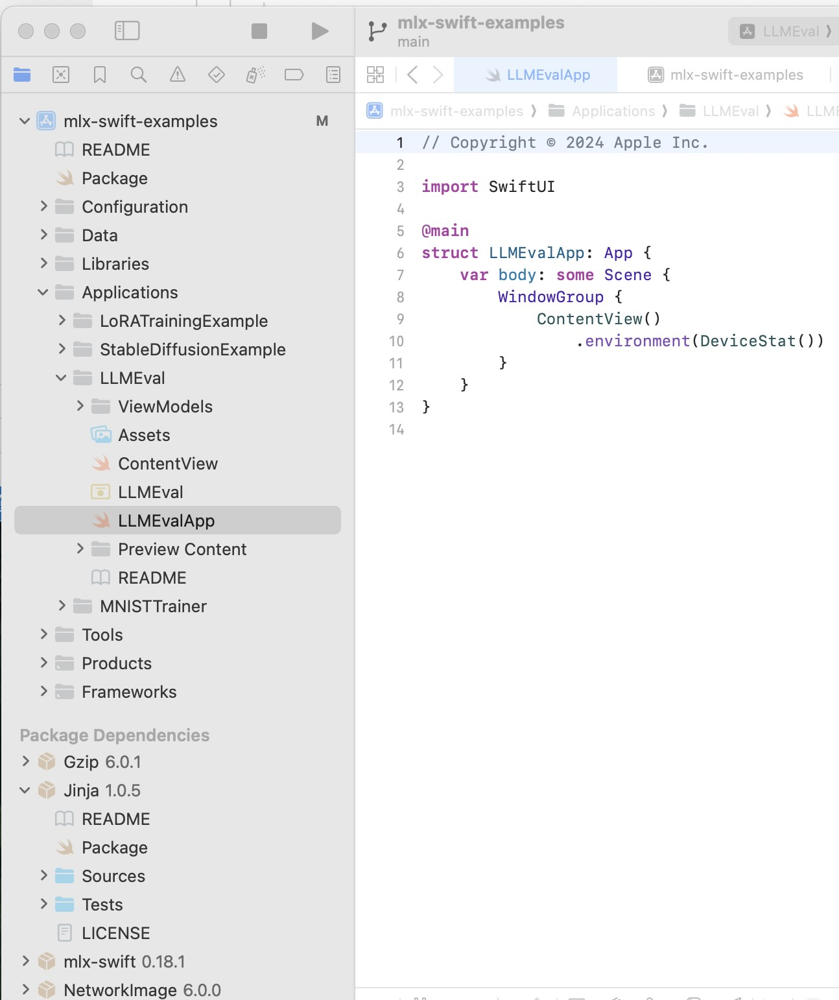
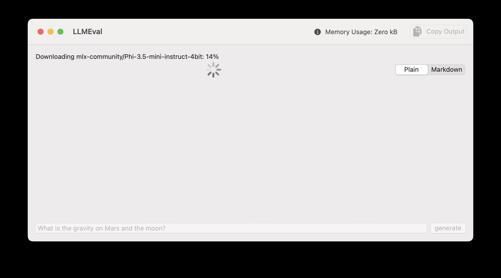
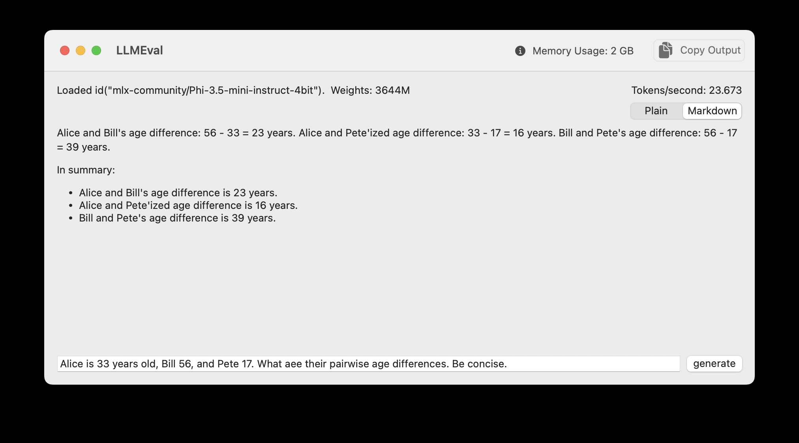

# Using Apple's MLX Framework to Run Local LLMs

Apple's MLX framework is an efficient way to use LLMs embedded in applications written in Swift using the SwiftUI user interface library for macOS, iOS, and iPadOS.

It is difficult to create simple command line Swift apps using MLX but there are several complete MLX, Swift, and SwiftUI demo applications that you can use to start your own projects. Here we will use the **LLMEval** application from the GitHub repository [https://github.com/ml-explore/mlx-swift-examples](https://github.com/ml-explore/mlx-swift-examples).

## MLX Framework History

Apple’s MLX framework, introduced in December 2023, is a key part of Apple’s strategy to support AI on its hardware platforms by leveraging the unique capabilities of Apple Silicon, including the M1, M2, M3, and M4 series. Designed as an open-source, NumPy-like array framework, MLX optimizes machine learning workloads, particularly large language models (LLMs), by utilizing Apple Silicon’s unified architecture that integrates CPU, GPU, Neural Engine, and shared memory. This architecture eliminates data transfer bottlenecks, enabling faster and more efficient ML tasks, such as training and deploying LLMs directly on devices like MacBooks and iPhones. MLX aligns with Apple’s privacy-focused approach by supporting on-device processing, enhancing performance for applications like natural language processing, speech recognition, and content generation while offering a seamless transition for Python or Swift ML engineers familiar with frameworks like NumPy and PyTorch. MLX stands out by leveraging Apple’s unified memory architecture, allowing shared memory access between CPU and GPU, which eliminates data transfer overhead and accelerates machine learning tasks, especially with large datasets.

## MLX Resources on GitHub

In this chapter we will look at an example application that is part of the Swift MLX Examples project. After working through this example, the following resources on GitHub are worth looking at:

- https://github.com/ml-explore/mlx-swift: The Swift API for MLX, enabling integration with Swift-based projects.
- https://github.com/ml-explore/mlx-swift-examples: Examples showcasing the use of MLX with Swift.

You can find the documentation here:

[https://swiftpackageindex.com/ml-explore/mlx-swift/0.18.0/documentation/mlx](https://swiftpackageindex.com/ml-explore/mlx-swift/0.18.0/documentation/mlx).

These repositories provide a comprehensive set of tools and examples to effectively utilize MLX for machine learning tasks on Apple silicon. There are many other repositories for MLX and Python and if you need to perform tasks like fine tuning a MLX model, that task should probably be done using Python.

## Example Application for MLX Swift Examples Repository

You will want to download the complete MLX Swift examples repository:

{linenos=off}
~~~~~~~~
git clone https://github.com/ml-explore/mlx-swift-examples.git
~~~~~~~~

Open the top level XCode project by:

{linenos=off}
~~~~~~~~
cd mlx-swift-examples
open mlx-swift-examples.xcodeproj
~~~~~~~~

Here is the file browser view of this project:

Running the LLMEval project:

Initially the model is downloaded and cached on your laptop for future use. Here is the app used to solve a simple word problem:

## Analysis of Swift and SwiftUI Code in the LLMEval Application

This example is part of the Swift MLX Examples project that currently has twenty contributors and a thousand stars on GitHub [https://github.com/ml-explore/mlx-swift-examples](https://github.com/ml-explore/mlx-swift-examples).

Unfortunately the SwiftUI user interface code is mixed in with the code that uses MLX. Let's walk through the code:

Here is a walk through a Swift-based program using Apple's frameworks for Machine Learning and Language Models with the code interspersed with explanations.

### Imports

{lang="swift",linenos=off}
~~~~~~~~
import LLM
import MLX
import MLXRandom
import MarkdownUI
import Metal
import SwiftUI
import Tokenizers
~~~~~~~~

These imports bring in essential libraries:

- LLM and MLX for working with language models.
- MarkdownUI for rendering Markdown content.
- SwiftUI for creating the user interface.
- Tokenizers for tokenizing text.

### The ContentView Struct

The ContentView struct defines the main interface of the app.

**State Variables**

{lang="swift",linenos=off}
~~~~~~~~
struct ContentView: View {

  @State var prompt = ""
  @State var llm = LLMEvaluator()
  @Environment(DeviceStat.self) private var deviceStat
~~~~~~~~

In this code snippet:

- @State allows the view to track changes in the prompt and llm instances.
- @Environment fetches device statistics, such as GPU memory usage.

**Display Style Enum**

{lang="swift",linenos=off}
~~~~~~~~
  enum displayStyle: String, CaseIterable, Identifiable {
    case plain, markdown
    var id: Self { self }
  }
  
  @State private var selectedDisplayStyle = displayStyle.markdown
~~~~~~~~

In this code snippet:

- **displayStyle** defines whether the output is plain text or Markdown.
- A segmented picker toggles between the two styles.

### UI Layout

**Input Section**

{lang="swift",linenos=off}
~~~~~~~~
  var body: some View {
    VStack(alignment: .leading) {
      VStack {
       HStack {
         Text(llm.modelInfo).textFieldStyle(.roundedBorder)
         Spacer()
         Text(llm.stat)
       }
       HStack {
         Spacer()
         if llm.running {
            ProgressView().frame(maxHeight: 20)
            Spacer()
          }
          Picker("", selection: $selectedDisplayStyle) {
            ForEach(displayStyle.allCases, id: \.self) {
              option in
                Text(option.rawValue.capitalized)
                        .tag(option)
            }

           }.pickerStyle(.segmented)
        }
      }
~~~~~~~~

This code displays model information and statistics.

**Output Section**

{lang="swift",linenos=off}
~~~~~~~~
      ScrollView(.vertical) {
        ScrollViewReader { sp in
          Group {
            if selectedDisplayStyle == .plain {
                Text(llm.output)
                    .textSelection(.enabled)
            } else {
                Markdown(llm.output)
                    .textSelection(.enabled)
            }
          }
          .onChange(of: llm.output) { _, _ in
            sp.scrollTo("bottom")
          }
        }
      }

      HStack {
        TextField("prompt", text: $prompt)
                    .onSubmit(generate)
                    .disabled(llm.running)
        Button("generate", action: generate)
                    .disabled(llm.running)
       }
      }
~~~~~~~~

The ScrollView shows the model’s output, which updates dynamically as the model generates text.

**Toolbar**

{lang="swift",linenos=off}
~~~~~~~~
      .toolbar {
         ToolbarItem {
           Label(
            "Memory Usage: \(deviceStat.gpuUsage.activeMemory.formatted(.byteCount(style: .memory)))",
            systemImage: "info.circle.fill"
           )
          }
          ToolbarItem(placement: .primaryAction) {
             Button {
               Task {
                copyToClipboard(llm.output)
               }
              } label: {
                Label("Copy Output", systemImage: "doc.on.doc.fill")
              }
           }
        }
~~~~~~~~

The toolbar includes:

- GPU memory usage information.
- A “Copy Output” button to copy the generated text.

### The LLMEvaluator Class

This class handles the logic for loading and generating text with the language model.

**Core Properties**

{lang="swift",linenos=off}
~~~~~~~~
@Observable
@MainActor
class LLMEvaluator {
  var running = false
  var output = ""
  var modelInfo = ""
  var stat = ""
  let modelConfiguration = ModelConfiguration.phi3_5_4bit
  /// parameters controlling the output
  let generateParameters = GenerateParameters(temperature: 0.6)
  let maxTokens = 240

  /// update the display every N tokens -- 4 looks like it updates continuously
  /// and is low overhead.  observed ~15% reduction in tokens/s when updating
  /// on every token
  let displayEveryNTokens = 4

  enum LoadState {
        case idle
        case loaded(ModelContainer)
  }

  var loadState = LoadState.idle
~~~~~~~~

This code snippet:

- Tracks the model state and output.
- Configures the model (phi3_5_4bit).

**Loading the Model (if required)**

{lang="swift",linenos=off}
~~~~~~~~
  /// load and return the model -- can be called
  /// multiple times, subsequent calls will
  /// just return the loaded model
 
  func load() async throws -> ModelContainer {
    switch loadState {
    case .idle:
        MLX.GPU.set(cacheLimit: 20 * 1024 * 1024)
        let modelContainer =
          try await LLM.loadModelContainer(configuration: modelConfiguration) {
            [modelConfiguration] progress in
            Task { @MainActor in
                self.modelInfo = "Downloading \(modelConfiguration.name): \(Int(progress.fractionCompleted * 100))%"
            }
        }
        self.modelInfo = "Loaded \(modelConfiguration.id). Weights: \(numParams / (1024*1024))M"
        loadState = .loaded(modelContainer)
        return modelContainer
    case .loaded(let modelContainer):
        return modelContainer
    }
  }
~~~~~~~~

This code snippet:

- Downloads and caches the model.
- Updates modelInfo during the download.

**Generating Output**

{lang="swift",linenos=off}
~~~~~~~~
  func generate(prompt: String) async {
    guard !running else { return }
    running = true
    self.output = ""

    do {
        let modelContainer = try await load()
        let messages = [["role": "user", "content": prompt]]
        let promptTokens = try await modelContainer.perform { _, tokenizer in
            try tokenizer.applyChatTemplate(messages: messages)
        }

        let result = await modelContainer.perform { model, tokenizer in
            LLM.generate(
                promptTokens: promptTokens,
                parameters: generateParameters, model: model,
                tokenizer: tokenizer,
                extraEOSTokens: modelConfiguration.extraEOSTokens
            ) { tokens in
                if tokens.count % displayEveryNTokens == 0 {
                    let text = tokenizer.decode(tokens: tokens)
                    Task { @MainActor in
                        self.output = text
                    }
                }
                if tokens.count >= maxTokens {
                    return .stop
                } else {
                    return .more
                }
            }
        }
    } catch {
        output = "Failed: \(error)"
    }
    running = false
  }
}
~~~~~~~~

This code snippet:

- Prepares the prompt for the model.
- Generates tokens and dynamically updates the view.

This program demonstrates how to integrate ML and UI components for interactive LLM-based applications in Swift.

This code example uses the MIT License so you can modify the example code if you need to write a combined SwiftUI GUI app that uses LLM-based text generation.
 

