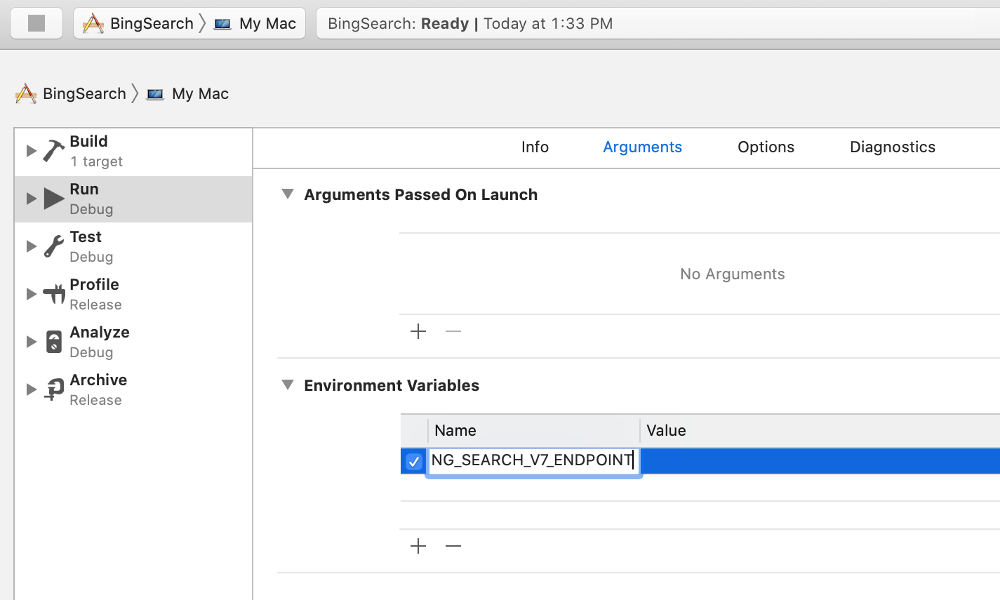
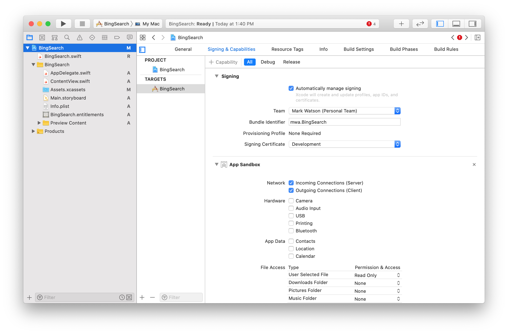

# Using the Microsoft Bing Search APIs in Swift

You will need to register with Microsoft's Azure search service to use the material in this chapter. It is likely that you view search as a manual human-centered activity. I hope to expand your thinking to considering applications that automate search, finding information on the web, and automatically organize information.

There will be four search examples in the [github repo for this book](https://github.com/mark-watson/SwiftAI-book-code): a Swift Playground (versions for iOS and macOS), a macOS specific comand line utility, a command line utility that is cross-platform, and a simple app written using SwiftUI (versions for both macOS and iOS).

## Getting an Access Key for Microsoft Bing Search APIs

TBD

## SwiftUI Project for macOS and iOS

{width=75%}

TBD

{width=75%}

{lang="swift",linenos=on}
~~~~~~~~
import Foundation

let endpoint = "https://api.cognitive.microsoft.com/bing/v7.0/search"
let apiKey = "???" value of BING_SEARCH_V7_SUBSCRIPTION_KEY

public func searchText(query: String, completionHandler: @escaping (String) -> Void) {
    print("+ entering searchText: ", query)
    var components = URLComponents(string: endpoint)!
    components.queryItems = [
        URLQueryItem(name: "q", value: query),
        URLQueryItem(name: "count", value: "2")
    ]

    var request = URLRequest(url: components.url!)
    request.addValue(apiKey, forHTTPHeaderField: "Ocp-Apim-Subscription-Key")

    let task = URLSession.shared.dataTask(with: request) { (data, response, error) in
        if let error = error {
            fatalError(error.localizedDescription)
        }

        guard let data = data else {
            fatalError("Empty response")
        }
        let str = String(decoding: data, as: UTF8.self)
        print("+   str:", str)
        let json = try? JSONSerialization.jsonObject(with: data, options: [])
        if let json2 = json as! Optional<Dictionary<String, Any?>> {
            if let head = json2["webPages"] as? Dictionary<String, Any> {
                if let xvars = head["value"] as! NSArray? {
                    print(xvars)
                    for x in xvars {
                        print(x)
                        if let d1: Dictionary<String, Any> = x as? Dictionary<String, Any> {
                            if let u = d1["displayUrl"] {
                               print("displayUrl", u)
                            }
                        }
                    }
                }
            }
        }
        completionHandler(str)
    }

    task.resume()
}

//PlaygroundPage.current.needsIndefiniteExecution = true

~~~~~~~~

## Swift Project for Linux

TBD
