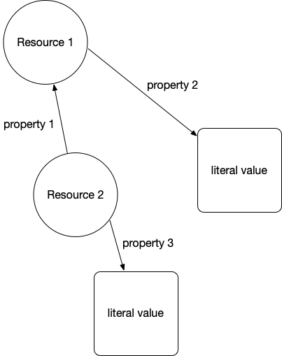
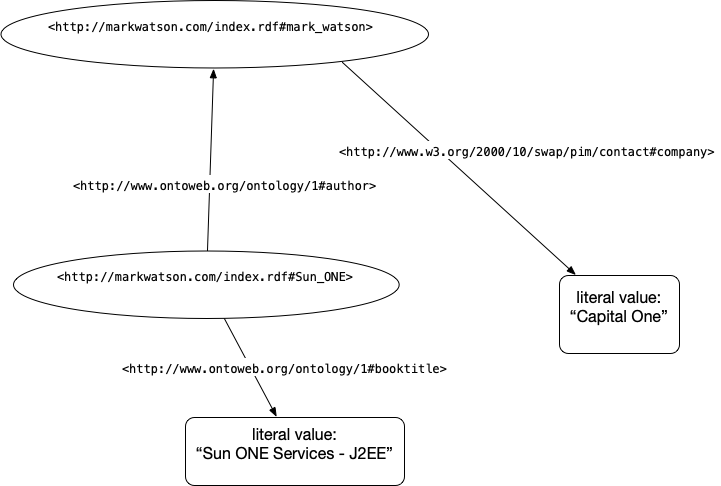
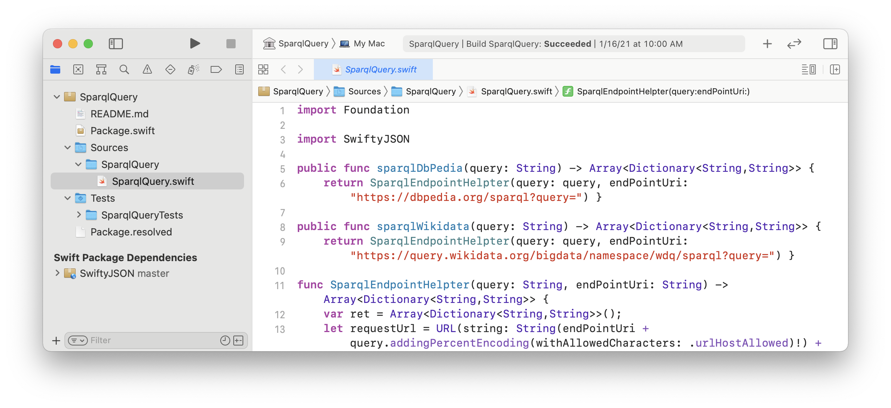

# Linked Data and the Semantic Web

Tim Berners-Lee, James Hendler, and Ora Lassila wrote a 2001 article for Scientific American titled *"The Semantic Web"* that introduced the concept to a wide audience. Throughout this chapter I use the terms *semantic web* and *linked data* somewhat interchangeably (without capitalizing them), though the semantic web carries a broader, more ambitious vision.

In the same way that the web allows links between related web pages, linked data supports linking associated data on the web together. I view linked data as a relatively simple way to specify relationships between data sources on the web while the semantic web has a much larger vision: the semantic web has the potential to be the entirety of human knowledge represented as data on the web in a form that software agents can work with to answer questions, perform research, and to infer new data from existing data.

While the "web" describes information for human readers, the semantic web is meant to provide structured data for ingestion by software agents. This distinction will be clear as we compare Wikipedia, made for human readers, with DBpedia which uses the info boxes on Wikipedia topics to automatically extract RDF data describing Wikipedia topics. Let's look at the Wikipedia topic for the town of Sedona, Arizona, where I live, and show how the info box on the English version of the [Wikipedia page for Sedona](https://en.wikipedia.org/wiki/Sedona,_Arizona) maps to the [DBpedia page for Sedona](http://dbpedia.org/page/Sedona,_Arizona). Please open both of these URLs in two browser tabs and keep them open for reference.

A more modern alternative to DBpedia is [Wikidata](https://www.wikidata.org/), which has largely superseded DBpedia as the primary structured-data companion to Wikipedia. Wikidata maintains its own SPARQL endpoint at [https://query.wikidata.org/](https://query.wikidata.org/) and is actively developed and well-maintained — worth exploring once you are comfortable with the concepts in this chapter.

I assume that the format of the WikiPedia page is familiar so let's look at the DBPedia page for Sedona that in human readble form shows the RDF statements with Sedona Arizona as the subject. RDF is used to model and represent data. RDF is defined by three values so an instance of an RDF statement is called a *triple* with three parts:

- subject: a URI (also referred to as a "Resource")
- property: a URI (also referred to as a "Resource")
- value: a URI (also referred to as a "Resource") or a literal value (like a string or a number with optional units)

The subject for each Sedona related triple is the above URI for the DBPedia human readable page. The subject and property references in an RDF triple will almost always be a URI that can ground an entity to information on the web. The human readable page for Sedona lists several properties and the values of these properties. One of the properties is "dbo:areaCode" where "dbo" is a name space reference (in this case for a [DatatypeProperty](http://www.w3.org/2002/07/owl#DatatypeProperty)).

The following two figures show an abstract representation of linked data and then a sample of linked data with actual web URIs for resources and properties:

{width: "50%"}

{width: "75%"}

We will use the SPARQL query language (SPARQL for RDF data is similar to SQL for relational database queries). Let's look at a live example using DBpedia data for Sedona, Arizona:

        SELECT ?population WHERE {
          <http://dbpedia.org/resource/Sedona,_Arizona>
          <http://dbpedia.org/ontology/populationTotal>
          ?population }

This query returns the total population of Sedona as stored in DBpedia. You can run it at the public DBpedia SPARQL endpoint at [https://dbpedia.org/sparql](https://dbpedia.org/sparql). If you wanted to query for all cities along with their populations, you can broaden the pattern:

        SELECT ?city ?population WHERE {
          ?city a <http://dbpedia.org/ontology/City> ;
                <http://dbpedia.org/ontology/populationTotal>
                ?population }
        LIMIT 10

Note that **?city** and **?population** are arbitrary query variable names — you can name them anything descriptive. The `?variable` syntax denotes an unbound variable that SPARQL will fill in from matching triples in the graph.

We will be diving a little deeper into RDF examples in the next chapter when we write a tool for using RDF data from DBPedia to find information about entities (e.g., people, places, organizations) and the relationships between entities.  For now I want you to understand the idea of RDF statements represented as triples, that web URIs represent things, properties, and sometimes values, and that URIs can be followed manually (often called "dereferencing") to see what they reference in human readable form.

## Understanding the Resource Description Framework (RDF)

Text data on the web has some structure in the form of HTML elements like headers, page titles, anchor links, etc. but this structure is too imprecise for general use by software agents. RDF is a method for encoding structured data in a more precise way.

RDF specifies graph structures and can be serialized for storage or for service calls in XML, Turtle, N3, and other formats. I like the Turtle format and suggest that you pause reading this book for a few minutes and look at the current W3C Turtle specification and primer at [https://www.w3.org/TR/turtle/](https://www.w3.org/TR/turtle/).

## Frequently Used Resource Namespaces

The following standard namespaces are frequently used:

- RDF       [https://www.w3.org/TR/rdf-syntax-grammar/](https://www.w3.org/TR/rdf-syntax-grammar/)
- RDFS      [https://www.w3.org/TR/rdf-schema/](https://www.w3.org/TR/rdf-schema/)
- OWL       [http://www.w3.org/2002/07/owl#](http://www.w3.org/2002/07/owl#)
- XSD       [http://www.w3.org/2001/XMLSchema#](http://www.w3.org/2001/XMLSchema#)
- FOAF      [http://xmlns.com/foaf/0.1/](http://xmlns.com/foaf/0.1/)
- SKOS      [http://www.w3.org/2004/02/skos/core#](http://www.w3.org/2004/02/skos/core#)
- DOAP      [http://usefulinc.com/ns/doap#](http://usefulinc.com/ns/doap#)
- DC        [http://purl.org/dc/elements/1.1/](http://purl.org/dc/elements/1.1/)
- DCTERMS   [http://purl.org/dc/terms/](http://purl.org/dc/terms/)
- VOID      [http://rdfs.org/ns/void#](http://rdfs.org/ns/void#)

Let's look into the Friend of a Friend (FOAF) namespace. Click on the above link for FOAF [http://xmlns.com/foaf/0.1/](http://xmlns.com/foaf/0.1/) and find the definitions for the FOAF Core:

        Agent
        Person
        name
        title
        img
        depiction (depicts)
        familyName
        givenName
        knows
        based_near
        age
        made (maker)
        primaryTopic (primaryTopicOf)
        Project
        Organization
        Group
        member
        Document
        Image

and for the Social Web (the most commonly used properties):

    mbox
    homepage
    weblog
    interest
    topic_interest
    topic (page)
    workplaceHomepage
    workInfoHomepage
    schoolHomepage
    publications
    currentProject
    pastProject
    account
    OnlineAccount
    accountName
    accountServiceHomepage
    PersonalProfileDocument

Note that older FOAF Social Web properties such as `openid`, `jabberID`, and `mbox_sha1sum` are now largely obsolete and have been omitted above.

You have now seen a few common RDF vocabularies. Another vocabulary widely used for annotating web pages is [schema.org](https://schema.org) — it is the shared vocabulary used by Google, Bing, and other major search engines to parse structured data embedded in HTML pages (via Microdata or JSON-LD formats). While we won't use schema.org directly in our examples, it is worth knowing about as you encounter it throughout the web.

## Understanding the SPARQL Query Language

For the purposes of the material in this book, the two sample SPARQL queries here are sufficient for you to get started using my SPARQL library [https://github.com/mark-watson/SparqlQuery_swift](https://github.com/mark-watson/SparqlQuery_swift) with arbitrary RDF data sources and simple queries.

{width: "90%"}

The Apache Foundation has a [good introduction to SPARQL](https://jena.apache.org/tutorials/sparql.html) that I refer you to for more information.

## LLMs and the Semantic Web

Modern large language models (LLMs) like those we use throughout this book open exciting new possibilities for working with semantic web data. An LLM can translate a natural-language question into a SPARQL query automatically, dramatically lowering the barrier to querying knowledge graphs like DBpedia or Wikidata. Conversely, knowledge graphs can serve as a source of grounded, verifiable facts that help reduce LLM hallucinations — a technique sometimes called *retrieval-augmented generation over knowledge graphs*. The Swift SPARQL tool we build in the next chapter is a small but concrete example of this kind of hybrid approach.

## Semantic Web and Linked Data Wrap Up

In the next chapter we will use SPARQL queries to extract structured information from DBpedia about entities such as people, places, and organizations. We will be using my Swift SPARQL library [https://github.com/mark-watson/SparqlQuery_swift](https://github.com/mark-watson/SparqlQuery_swift) to run queries against live endpoints.

