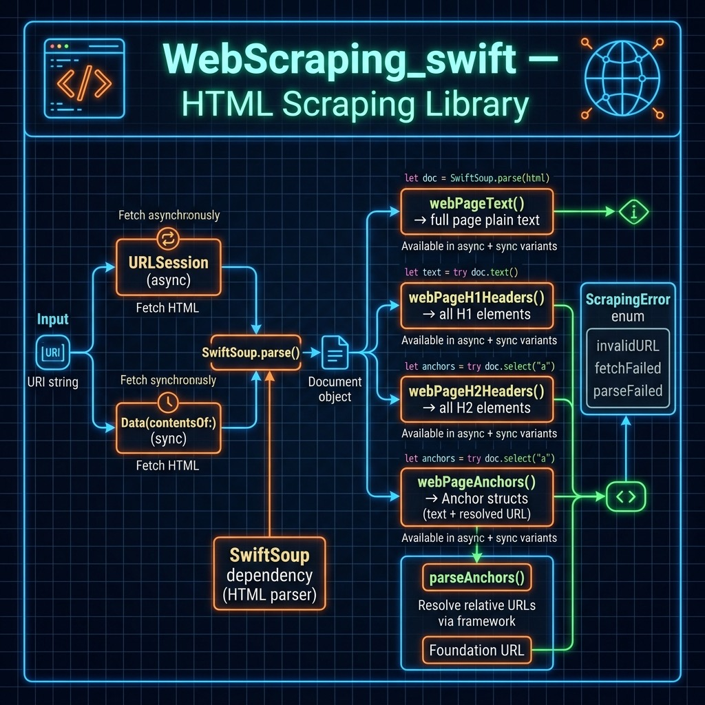

# Web Scraping

It is important to respect the property rights of web site owners and abide by their terms and conditions for use. This [Wikipedia article on Fair Use](https://en.wikipedia.org/wiki/Fair_use) provides a good overview of using copyright material.

The web scraping code we develop here uses the Swift library **SwiftSoup** that is loosely based on the BeautifulSoup libraries available in other programming languages.

For my work and research, I have been most interested in using web scraping to collect text data for natural language processing but other common applications include writing AI news collection and summarization assistants, trying to predict stock prices based on comments in social media which is what we did at Webmind Corporation in 2000 and 2001, etc.

I wrote a simple web scraping library that is available in **source-code/WebScraping_swift**.

Here is the main implementation file for the library:

{lang="swift",linenos=on}
~~~~~~~~
import Foundation
import SwiftSoup

public enum ScrapingError: Error {
    case invalidURL(String)
    case fetchFailed(Error)
    case parseFailed(Error)
}

public struct Anchor: Equatable {
    public let text: String
    public let url: URL
}

/// Helper to parse HTML data into a SwiftSoup Document.
private func parse(data: Data, uri: String) throws -> Document {
    guard let html = String(data: data, encoding: .utf8) else {
        throw ScrapingError.parseFailed(
            NSError(
                domain: "WebScraping",
                code: 1,
                userInfo: [
                    NSLocalizedDescriptionKey:
                        "Failed to decode UTF-8 data"
                ]
            )
        )
    }

    do {
        return try SwiftSoup.parse(html, uri)
    } catch {
        throw ScrapingError.parseFailed(error)
    }
}

/// Fetches the HTML document from a given URI and parses it asynchronously.
private func fetchDocument(uri: String) async throws -> Document {
    guard let url = URL(string: uri) else {
        throw ScrapingError.invalidURL(uri)
    }

    let data: Data
    do {
        (data, _) = try await URLSession.shared.data(from: url)
    } catch {
        throw ScrapingError.fetchFailed(error)
    }

    return try parse(data: data, uri: uri)
}

/// Fetches the HTML document from a given URI and parses it synchronously.
private func fetchDocument(uri: String) throws -> Document {
    guard let url = URL(string: uri) else {
        throw ScrapingError.invalidURL(uri)
    }

    let data: Data
    do {
        data = try Data(contentsOf: url)
    } catch {
        throw ScrapingError.fetchFailed(error)
    }

    return try parse(data: data, uri: uri)
}

/// Returns the plain text content of a web page (asynchronous).
public func webPageText(uri: String) async throws -> String {
    let doc = try await fetchDocument(uri: uri)
    return try doc.text()
}

/// Returns the plain text content of a web page (synchronous).
public func webPageText(uri: String) throws -> String {
    let doc = try fetchDocument(uri: uri)
    return try doc.text()
}

/// Helper for headers (asynchronous).
private func webPageHeadersHelper(
    uri: String,
    headerName: String
) async throws -> [String] {
    let doc = try await fetchDocument(uri: uri)
    let headers = try doc.select(headerName)
    return try headers.map { try $0.text() }
}

/// Helper for headers (synchronous).
private func webPageHeadersHelper(
    uri: String,
    headerName: String
) throws -> [String] {
    let doc = try fetchDocument(uri: uri)
    let headers = try doc.select(headerName)
    return try headers.map { try $0.text() }
}

/// Returns all H1 headers on the page (asynchronous).
public func webPageH1Headers(uri: String) async throws -> [String] {
    return try await webPageHeadersHelper(uri: uri, headerName: "h1")
}

/// Returns all H1 headers on the page (synchronous).
public func webPageH1Headers(uri: String) throws -> [String] {
    return try webPageHeadersHelper(uri: uri, headerName: "h1")
}

/// Returns all H2 headers on the page (asynchronous).
public func webPageH2Headers(uri: String) async throws -> [String] {
    return try await webPageHeadersHelper(uri: uri, headerName: "h2")
}

/// Returns all H2 headers on the page (synchronous).
public func webPageH2Headers(uri: String) throws -> [String] {
    return try webPageHeadersHelper(uri: uri, headerName: "h2")
}

/// Returns all anchors (links) found on the page as `Anchor` objects (asynchronous).
public func webPageAnchors(uri: String) async throws -> [Anchor] {
    let doc = try await fetchDocument(uri: uri)
    return try parseAnchors(doc: doc, uri: uri)
}

/// Returns all anchors (links) found on the page as `Anchor` objects (synchronous).
public func webPageAnchors(uri: String) throws -> [Anchor] {
    let doc = try fetchDocument(uri: uri)
    return try parseAnchors(doc: doc, uri: uri)
}

/// Shared anchor parsing logic.
private func parseAnchors(doc: Document, uri: String) throws -> [Anchor] {
    let anchors = try doc.select("a")
    let baseURL = URL(string: uri)

    return try anchors.compactMap { a -> Anchor? in
        let text = try a.text()
        let href = try a.attr("href")

        // Use Foundation's URL resolution for relative/fragment links.
        guard let resolvedURL = URL(string: href, relativeTo: baseURL) else {
            return nil
        }

        return Anchor(text: text, url: resolvedURL.absoluteURL)
    }
}
~~~~~~~~

This Swift code defines several functions that can be used to scrape information from a web page located at a given URI.

The library uses modern Swift concurrency (async/await) throughout. A `ScrapingError` enum provides typed error handling for invalid URLs, network failures, and parsing failures. The `Anchor` struct replaces the old `[[String]]` return type and holds a resolved `URL` alongside the link text.

The private **fetchDocument** helper does the shared heavy lifting: it validates the URI, fetches the raw data with `URLSession.shared.data(from:)` (async), decodes it as UTF-8, and returns a parsed SwiftSoup `Document`.

The **webPageText** function takes a URI as input and returns the plain text content of the web page located at that URI. It delegates to **fetchDocument** and then calls SwiftSoup's `doc.text()` to extract all plain text.

The **webPageH1Headers** and **webPageH2Headers** functions use the private **webPageHeadersHelper** function to extract the **H1** and **H2** header texts respectively from the web page. The helper uses `doc.select(headerName)` on the parsed document and maps each element to its text content.

The **webPageAnchors** function extracts all anchor tags **<a>** from the web page and returns them as an array of **Anchor** values. It resolves relative and fragment URLs against the page's base URL using Foundation's `URL(string:relativeTo:)`, discarding any links that cannot be resolved.

Overall, these functions provide a simple, modern way to scrape information from a web page and extract specific information such as plain text, header texts, and anchors.

I wrote these utility functions to get the plain text from a web site, HTML header text, and anchors. You can clone this library and extend it for other types of HTML elements you may need to process.

The test program shows how to call the APIs in the library:

{lang="swift",linenos=on}
~~~~~~~~
import XCTest
import Foundation
import SwiftSoup

@testable import WebScraping_swift

final class WebScrapingTests: XCTestCase {
    func testGetWebPage() {
        let text = webPageText(uri: "https://markwatson.com")
        print("\n\n\tTEXT FROM MARK's WEB SITE:\n\n", text)
    }

    func testToShowSwiftSoupExamples() {
        let myURLString = "https://markwatson.com"
        let h1_headers = webPageH1Headers(uri: myURLString)
        print("\n\n++ h1_headers:", h1_headers)
        let h2_headers = webPageH2Headers(uri: myURLString)
        print("\n\n++ h2_headers:", h2_headers)
        let anchors = webPageAnchors(uri: myURLString)
        print("\n\n++ anchors:", anchors)
}

    static var allTests = [("testGetWebPage", testGetWebPage),
                           ("testToShowSwiftSoupExamples",
                            testToShowSwiftSoupExamples)]
}
~~~~~~~~

This Swift test program tests the functionality of the **WebScraping_swift** library. It defines two test functions: **testGetWebPage** and **testToShowSwiftSoupExamples**.

The **testGetWebPage** function uses the **webPageText** function to retrieve the plain text content of my website located at "https://markwatson.com". It then prints the retrieved text to the console.

The **testToShowSwiftSoupExamples** function demonstrates the use of **webPageH1Headers**, **webPageH2Headers**, and **webPageAnchors** functions on the same website. It extracts and prints the H1 and H2 header texts and anchor tags of the same website.

The **allTests** variable is an array of tuples that map the test function names to the corresponding function references. This variable is used by the XCTest framework to discover and run the test functions.

Overall, this Swift test program demonstrates how to use the functions defined in the WebScraping_swift library to extract specific information from a web page.

Here we run the unit tests (with much of the output not shown for brevity):

{lang="bash",linenos=on}
~~~~~~~~
$ swift test

	TEXT FROM MARK's WEB SITE:

 Mark Watson: AI Practitioner and Polyglot Programmer | Mark Watson    Read my Blog    Fun stuff    My Books    My Open Source Projects    Hire Me    Free Mentoring    Privacy Policy Mark Watson: AI Practitioner and Polyglot Programmer I am the author of 20+ books on Artificial Intelligence, Common Lisp, Deep Learning, Haskell, Clojure, Java, Ruby, Hy language, and the Semantic Web. I have 55 US Patents. My customer list includes: Google, Capital One, Olive AI, CompassLabs, Disney, SAIC, Americast, PacBell, CastTV, Lutris Technology, Arctan Group, Sitescout.com, Embed.ly, and Webmind Corporation.

++ h1_headers: ["Mark Watson: AI Practitioner and Polyglot Programmer", "The books that I have written", "Fun stuff", "Open Source", "Hire Me", "Free Mentoring", "Privacy Policy"]

++ h2_headers: ["I am the author of 20+ books on Artificial Intelligence, Common Lisp, Deep Learning, Haskell, Clojure, Java, Ruby, Hy language, and the Semantic Web. I have 55 US Patents.", "Other published books:"]

++ anchors: [["Read my Blog", "https://mark-watson.blogspot.com"], ["Fun stuff", "https://markwatson.com#fun"], ["My Books", "https://markwatson.com#books"], ["My Open Source Projects", "https://markwatson.com#opensource"], ["Hire Me", "https://markwatson.com#consulting"], ["Free Mentoring", "https://markwatson.com#mentoring"], ["Privacy Policy", "https://markwatson.com/privacy.html"], ["leanpub", "https://leanpub.com/u/markwatson"], ["GitHub", "https://github.com/mark-watson"], ["LinkedIn", "https://www.linkedin.com/in/marklwatson/"], ["Twitter", "https://twitter.com/mark_l_watson"], ["leanpub", "https://leanpub.com/lovinglisp"], ["leanpub", "https://leanpub.com/haskell-cookbook/"], ["leanpub", "https://leanpub.com/javaai"], 
]
Test Suite 'All tests' passed at 2021-08-06 17:37:11.062.
	 Executed 2 tests, with 0 failures (0 unexpected) in 0.471 (0.472) seconds
~~~~~~~~

## Running in the Swift REPL

{lang="swift",linenos=on}
~~~~~~~~
$ swift run --repl
[1/1] Build complete!
Launching Swift REPL with arguments: -I/Users/markw_1/GIT_swift_book/WebScraping_swift/.build/arm64-apple-macosx/debug -L/Users/markw_1/GIT_swift_book/WebScraping_swift/.build/arm64-apple-macosx/debug -lWebScraping_swift__REPL
Welcome to Apple Swift version 5.5 (swiftlang-1300.0.29.102 clang-1300.0.28.1).
Type :help for assistance.
  1> import WebScraping_swift
  2> try webPageText(uri: "https://markwatson.com")
$R0: String = "Mark Watson: AI Practitioner and Polyglot Programmer | Mark Watson    Read my Blog    Fun stuff    My Books    My Open Source Projects    Privacy Policy Mark Watson: AI Practitioner and Polyglot Programmer I am the author of 20+ books on Artificial Intelligence, Common Lisp, Deep Learning, Haskell, Clojure, Java, Ruby, Hy language, and the Semantic Web. I have 55 US Patents. My customer list includes: Google, Capital One, Babylist, Olive AI, CompassLabs, Disney, SAIC, Americast, PacBell, CastTV, Lutris Technology, Arctan Group, Sitescout.com, Embed.ly, and Webmind Corporation"...
  3>  
~~~~~~~~

This chapter finishes a quick introduction to using Swift and Swift packages for command line utilities. The remainder of this book comprises machine learning, natural language processing, and semantic web/linked data examples.
