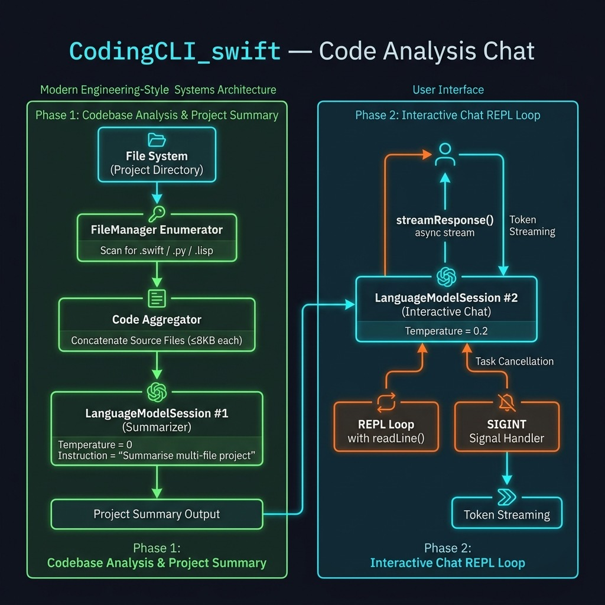

# CodingCLI — Code-Aware Chat with Apple Intelligence — Example for Mark Watson's book "Artificial Intelligence Using Swift"

Book URI: https://leanpub.com/SwiftAI

You can read my book for free online at: https://leanpub.com/SwiftAI/read

A command-line tool that reads all source files in the current directory, summarizes the project using Apple Intelligence, and then opens an interactive chat session where you can ask questions about your code.

**How it works:**

1. **Scan** — recursively finds all `.swift`, `.py`, and `.lisp` files under the current directory (files ≤ 8 KB each)
2. **Summarize** — sends the combined source to the on-device Apple Intelligence model and prints a per-file project summary
3. **Chat** — starts a streaming interactive session so you can ask follow-up questions about the codebase

This uses the **FoundationModels** framework — no API keys, no network calls during inference. Apple Intelligence handles everything locally (or via Private Cloud Compute for larger requests).

## Requirements

| Requirement | Minimum |
|---|---|
| macOS | 26 (Tahoe) |
| Apple Intelligence | Must be enabled in System Settings |
| Xcode | 17+ (for FoundationModels framework) |

## Build & Install

    swift build

Optionally copy the binary to a directory on your `$PATH` so you can run it from any project:

    cp .build/debug/CodingCLI ~/bin/

## Usage

Navigate to any source directory and run:

    CodingCLI

The tool prints a project summary, then starts an interactive chat loop. Type `/quit` or press Enter on an empty line to exit.

## Project Structure

```
CodingCLI_swift/
├── Package.swift
└── Sources/CodingCLI/
    └── CodingCLI.swift   # @main entry point: file scanning, summarization, and chat
```



## Book Cover Material, Copyright, and License

This example is released using the Apache 2 license.

Copyright 2022-2026 Mark Watson. All rights reserved.

## This Book is Licensed with Creative Commons Attribution CC BY Version 3 That Allows Reuse In Derived Works

You are free to:

- Share — copy and redistribute the material in any medium or format
- Adapt — remix, transform, and build upon the material
for any purpose, even commercially.

You are required to give appropriate credit in any derived works:

```text
This work is derived from all or part of "Artificial Intelligence Using Swift" by
Mark Watson. Source: https://leanpub.com/SwiftAI
```

Please visit the [author's website](http://markwatson.com).
