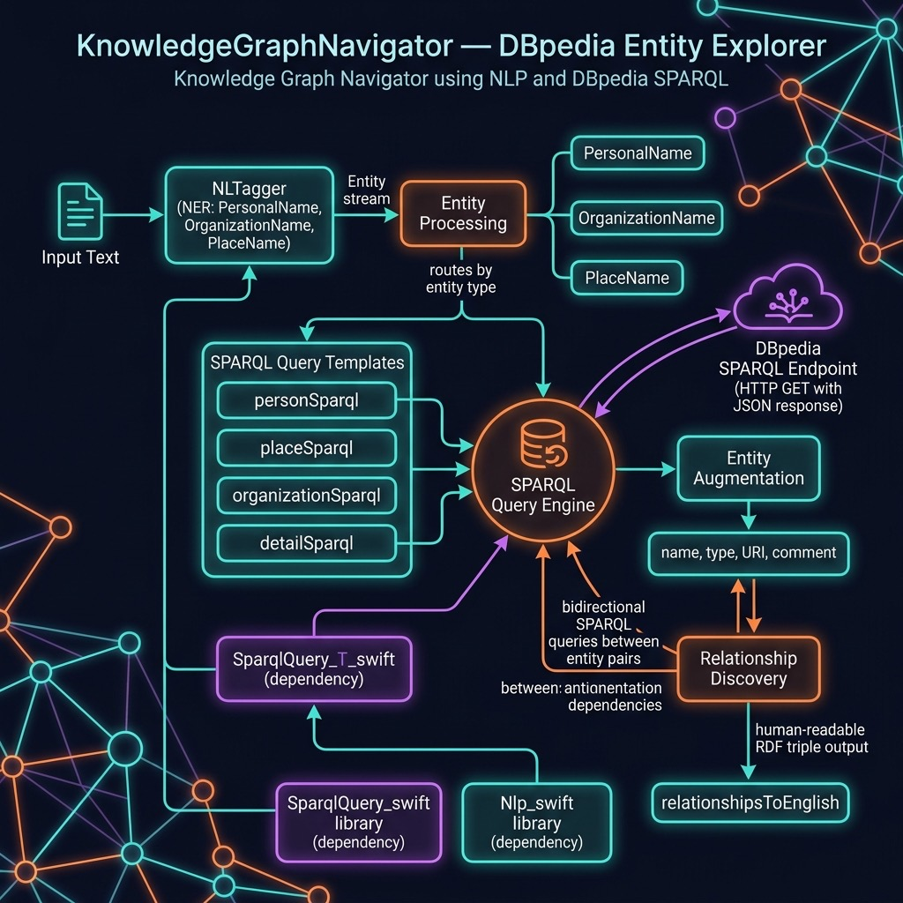

# Knowledge Graph Navigator — Example for Mark Watson's book "Artificial Intelligence Using Swift"

Book URI: https://leanpub.com/SwiftAI

You can read my book for free online at: https://leanpub.com/SwiftAI/read

Explores knowledge graphs by combining Apple's NaturalLanguage framework with live SPARQL queries against [DBpedia](https://dbpedia.org):

1. **Named Entity Recognition** — extracts people, places, and organizations from free text using `NLTagger`
2. **SPARQL Entity Lookup** — queries DBpedia for detailed descriptions of each extracted entity (birth place, alma mater, spouse, etc.)
3. **Relationship Discovery** — finds RDF triples that connect pairs of entities and translates them into readable English sentences

For example, given *"Bill Gates was at Microsoft with Melinda Gates"*, the program identifies three entities, retrieves their DBpedia URIs, and discovers relationships such as *"Bill Gates foundedBy Microsoft"*.

## Prerequisites

- The `SparqlQuery_swift` and `Nlp_swift` sibling packages (resolved automatically via local path dependencies)

## Run

    swift build
    swift run

## Key Source Files

| File | Description |
|---|---|
| `Sources/.../SparqlQuery/AppSparql.swift` | SPARQL query templates for persons, places, organizations; entity extraction pipeline |
| `Sources/.../Relationships/Relationships.swift` | Discovers and formats RDF relationship triples between entity pairs |
| `Sources/.../main.swift` | Demo: exercises entity extraction, detail lookup, and relationship discovery |



## Book Cover Material, Copyright, and License

This example is released using the Apache 2 license.

Copyright 2022-2026 Mark Watson. All rights reserved.

## This Book is Licensed with Creative Commons Attribution CC BY Version 3 That Allows Reuse In Derived Works

You are free to:

- Share — copy and redistribute the material in any medium or format
- Adapt — remix, transform, and build upon the material
for any purpose, even commercially.

You are required to give appropriate credit in any derived works:

```text
This work is derived from all or part of "Artificial Intelligence Using Swift" by
Mark Watson. Source: https://leanpub.com/SwiftAI
```

Please visit the [author's website](http://markwatson.com).