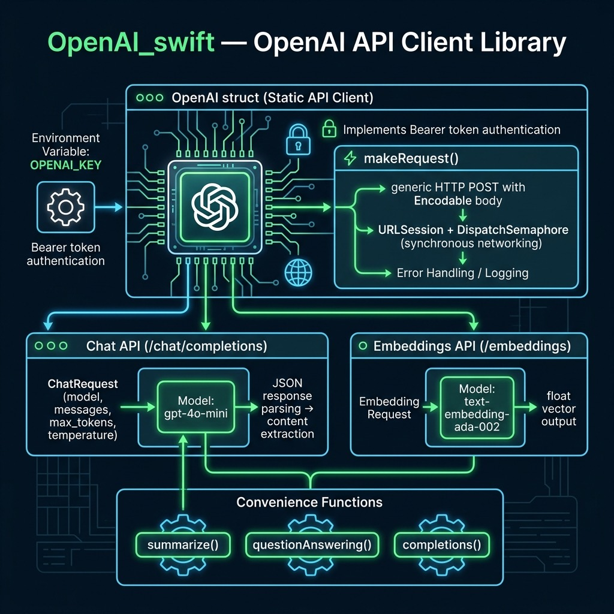

# OpenAI Swift API Library — Example for Mark Watson's book "Artificial Intelligence Using Swift"

Book URI: https://leanpub.com/SwiftAI

You can read my book for free online at: https://leanpub.com/SwiftAI/read

A lightweight, zero-dependency Swift wrapper around the [OpenAI REST API](https://platform.openai.com/docs/api-reference). Provides two core capabilities:

- **Chat Completions** (`gpt-4o-mini`) — text generation, summarization, and question answering
- **Embeddings** (`text-embedding-ada-002`) — vector representations for semantic similarity and search

The library uses Foundation's `URLSession` directly with `Codable` request types, so no third-party packages are required.

## Prerequisites

Set your OpenAI API key:

    export OPENAI_KEY="your-key-here"

## Usage

This package is a **library**. Add it as a dependency in another Swift package, or experiment with the public functions directly:

```swift
import OpenAI_swift

// Summarize text
let summary = summarize(text: "Long article text...", maxTokens: 60)

// Ask a question
let answer = questionAnswering(question: "What is the capital of France?")

// Get embeddings for semantic search
let vector = OpenAI.embeddings(text: "some sentence")
```

## Build & Test

    swift build
    swift test



## Book Cover Material, Copyright, and License

This example is released using the Apache 2 license.

Copyright 2022-2026 Mark Watson. All rights reserved.

## This Book is Licensed with Creative Commons Attribution CC BY Version 3 That Allows Reuse In Derived Works

You are free to:

- Share — copy and redistribute the material in any medium or format
- Adapt — remix, transform, and build upon the material
for any purpose, even commercially.

You are required to give appropriate credit in any derived works:

```text
This work is derived from all or part of "Artificial Intelligence Using Swift" by
Mark Watson. Source: https://leanpub.com/SwiftAI
```

Please visit the [author's website](http://markwatson.com).
