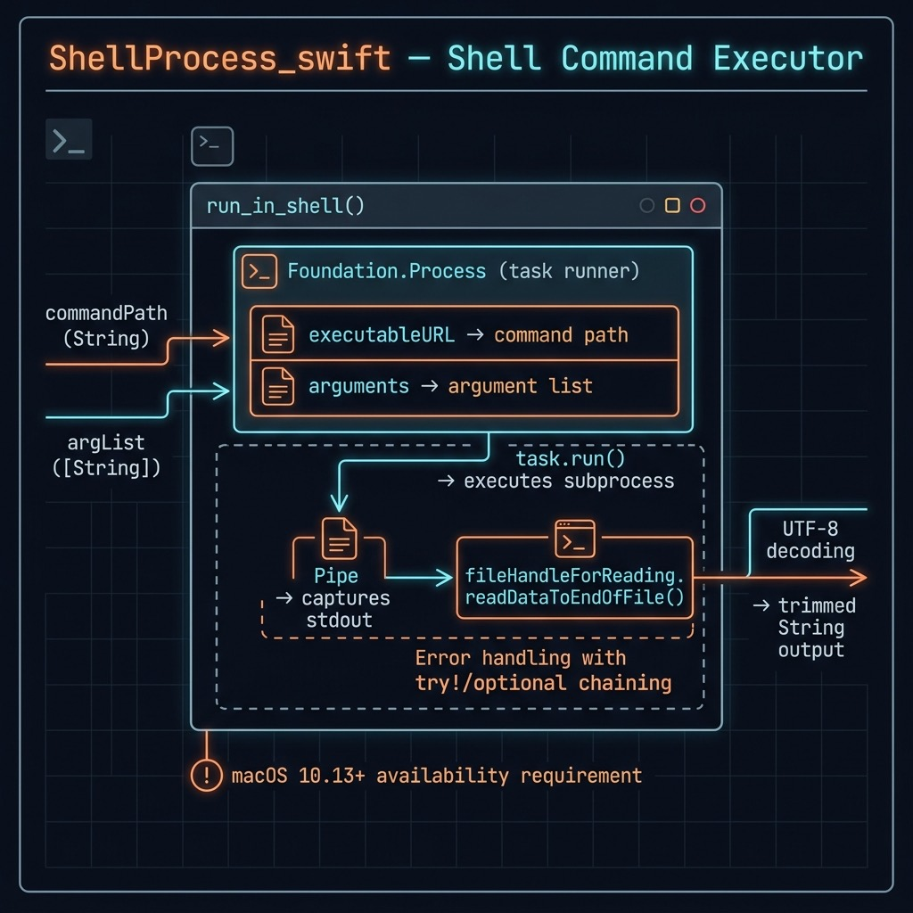

# ShellProcess — Example for Mark Watson's book "Artificial Intelligence Using Swift"

Book URI: https://leanpub.com/SwiftAI

You can read my book for free online at: https://leanpub.com/SwiftAI/read

A lightweight Swift library that wraps Foundation's `Process` API to run external shell commands and capture their output as a `String`. This is used by other projects in the book whenever they need to invoke a command-line tool from Swift code.

## API

```swift
import ShellProcess_swift

let output = run_in_shell(
    commandPath: "/usr/bin/git",
    argList: ["status"])
print(output)
```

The function launches the process synchronously and returns the trimmed standard output.

## Usage

This package is a **library** — it has no executable target. To use it in another Swift package, add it as a local dependency:

```swift
.package(name: "ShellProcess_swift", path: "../ShellProcess_swift")
```

## Build & Test

    swift build
    swift test



## Book Cover Material, Copyright, and License

This example is released using the Apache 2 license.

Copyright 2022-2026 Mark Watson. All rights reserved.

## This Book is Licensed with Creative Commons Attribution CC BY Version 3 That Allows Reuse In Derived Works

You are free to:

- Share — copy and redistribute the material in any medium or format
- Adapt — remix, transform, and build upon the material
for any purpose, even commercially.

You are required to give appropriate credit in any derived works:

```text
This work is derived from all or part of "Artificial Intelligence Using Swift" by
Mark Watson. Source: https://leanpub.com/SwiftAI
```

Please visit the [author's website](http://markwatson.com).
