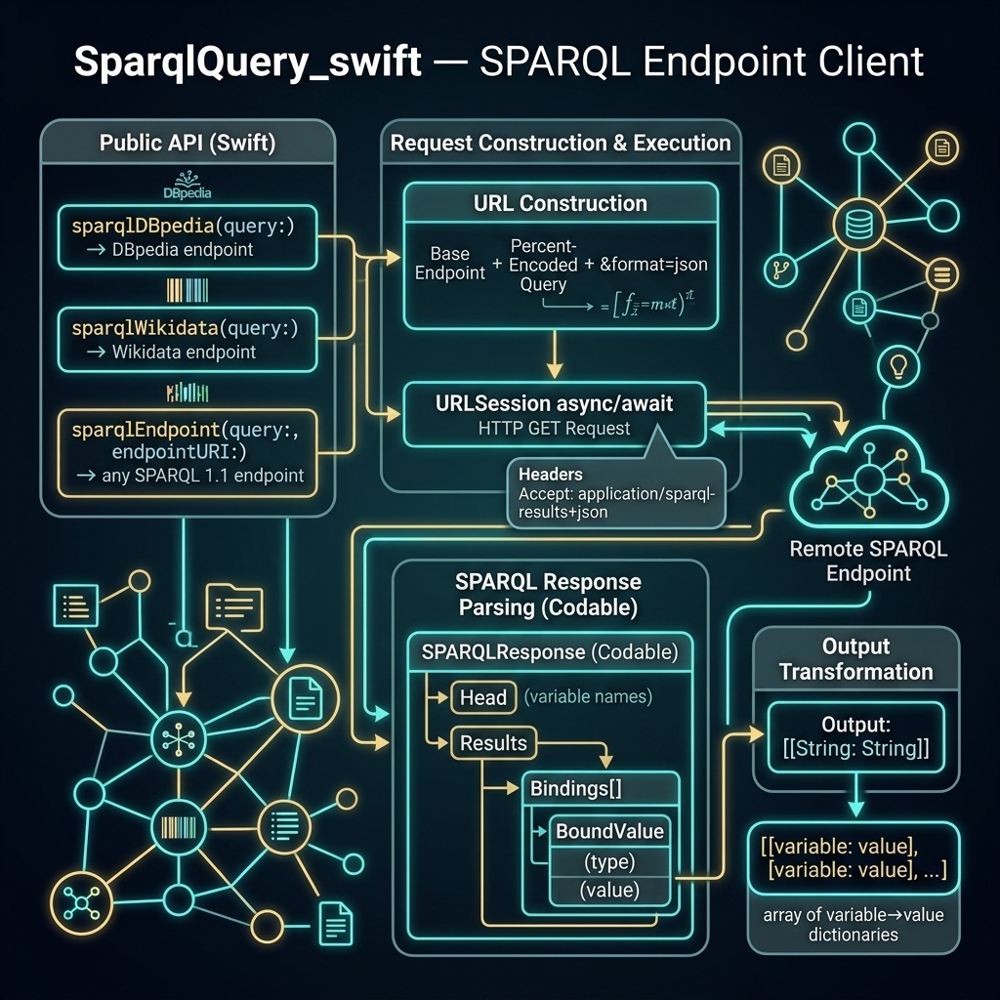

# SparqlQuery — Example for Mark Watson's book "Artificial Intelligence Using Swift"

Book URI: https://leanpub.com/SwiftAI

You can read my book for free online at: https://leanpub.com/SwiftAI/read

A zero-dependency Swift library for executing [SPARQL](https://www.w3.org/TR/sparql11-query/) queries against linked-data endpoints. It uses modern `async/await` networking and `Codable` JSON parsing — no external packages required.

Built-in convenience functions target two popular knowledge bases:

- **`sparqlDBpedia(query:)`** — queries [DBpedia](https://dbpedia.org/sparql) (structured data extracted from Wikipedia)
- **`sparqlWikidata(query:)`** — queries [Wikidata](https://query.wikidata.org/) (Wikimedia's open knowledge base)
- **`sparqlEndpoint(query:endpointURI:)`** — queries any standards-compliant SPARQL 1.1 endpoint

Results are returned as `[[String: String]]` — an array of dictionaries mapping variable names to their string values.

## Usage

This package is a **library** used by other projects in the book (e.g., `KnowledgeGraphNavigator_swift`). Add it as a local dependency:

```swift
.package(name: "SparqlQuery_swift", path: "../SparqlQuery_swift")
```

### Example

```swift
import SparqlQuery_swift

let results = try await sparqlDBpedia(query: """
    SELECT ?name ?comment WHERE {
        ?person a <http://dbpedia.org/ontology/Scientist> .
        ?person <http://xmlns.com/foaf/0.1/name> ?name .
        ?person <http://www.w3.org/2000/01/rdf-schema#comment> ?comment .
        FILTER (lang(?comment) = 'en')
    } LIMIT 5
    """)

for row in results {
    print(row["name"]!, "-", row["comment"]!)
}
```

## Build & Test

    swift build
    swift test



## Book Cover Material, Copyright, and License

This example is released using the Apache 2 license.

Copyright 2022-2026 Mark Watson. All rights reserved.

## This Book is Licensed with Creative Commons Attribution CC BY Version 3 That Allows Reuse In Derived Works

You are free to:

- Share — copy and redistribute the material in any medium or format
- Adapt — remix, transform, and build upon the material
for any purpose, even commercially.

You are required to give appropriate credit in any derived works:

```text
This work is derived from all or part of "Artificial Intelligence Using Swift" by
Mark Watson. Source: https://leanpub.com/SwiftAI
```

Please visit the [author's website](http://markwatson.com).
