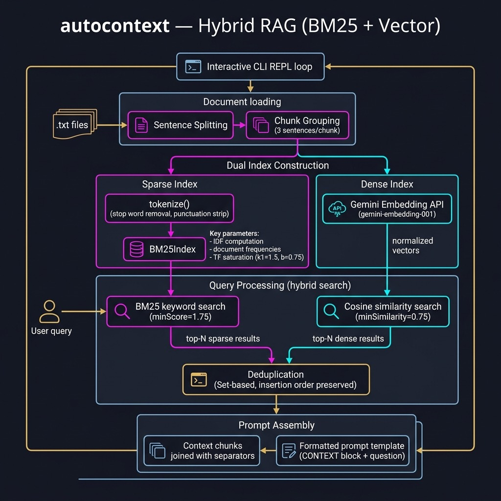

# AutoContext — Hybrid RAG Prompt Builder — Example for Mark Watson's book "Artificial Intelligence Using Swift"

Book URI: https://leanpub.com/SwiftAI

You can read my book for free online at: https://leanpub.com/SwiftAI/read

A Swift command-line tool that implements **hybrid Retrieval-Augmented Generation (RAG)**: it combines **BM25 keyword search** and **semantic vector search** (via the Gemini Embedding API) to retrieve the most relevant text chunks from a local document collection, then formats them into a one-shot prompt ready to send to any LLM.

**How it works:**

1. Load `.txt` documents from a data directory and split them into chunks
2. Build a **BM25 index** for fast keyword-based ranking
3. Generate **Gemini embeddings** for each chunk for semantic similarity search
4. At query time, combine BM25 and vector scores to find the most relevant context
5. Format the top results into a prompt with embedded context, ready for any LLM

## Prerequisites

- macOS 13+
- Swift 5.9+ / Xcode 15+
- A Google AI API key with the Gemini Embedding API enabled

## Setup

```bash
export GOOGLE_API_KEY="your_api_key_here"
```

Add your `.txt` documents to the shared **`source-code/data/`** directory
(one level up from this package). The tool also accepts a custom directory
path as its first CLI argument.

## Run

    swift build
    swift run AutoContext

Or with a custom data directory:

    swift run AutoContext /path/to/your/docs

## Project Structure

```
autocontext/
├── Package.swift
└── Sources/AutoContext/
    ├── main.swift          # Interactive CLI loop
    ├── AutoContext.swift   # Core hybrid RAG class
    ├── BM25.swift          # BM25 Okapi ranking algorithm
    ├── Embeddings.swift    # Gemini Embedding API client + vector math
```



## Book Cover Material, Copyright, and License

This example is released using the Apache 2 license.

Copyright 2022-2026 Mark Watson. All rights reserved.

## This Book is Licensed with Creative Commons Attribution CC BY Version 3 That Allows Reuse In Derived Works

You are free to:

- Share — copy and redistribute the material in any medium or format
- Adapt — remix, transform, and build upon the material
for any purpose, even commercially.

You are required to give appropriate credit in any derived works:

```text
This work is derived from all or part of "Artificial Intelligence Using Swift" by
Mark Watson. Source: https://leanpub.com/SwiftAI
```

Please visit the [author's website](http://markwatson.com).
